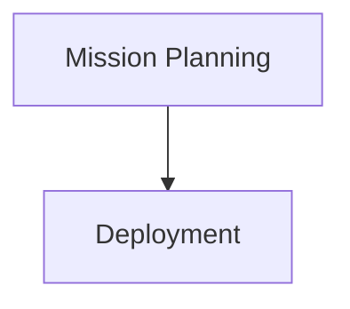

# Underwater Glider Operations Knowledge Base

A community-maintained reference wiki for all aspects of underwater glider operations — from initial lab setup through deployment, in-mission monitoring, recovery, and long-term maintenance.

The information here is an extract of vendor manuals, community forums, and Slack channel discussions. The aim is to organize that scattered knowledge and present it in a more structured, searchable form. It is not a replacement for the official manufacturer documentation — always defer to the manufacturer's guidance for your specific platform.

**This knowledge base is a work in progress.** So far it contains resources for the **Slocum** and **Seaglider** platforms, but the hope is to expand it to the SeaExplorer, Spray, and other types of glider over time. Contributions for any platform are very welcome — see [CONTRIBUTING.md](CONTRIBUTING.md).

Built with [MkDocs](https://www.mkdocs.org/) and the [Material theme](https://squidfunk.github.io/mkdocs-material/). Hosted at: **https://e-abdi.github.io/Glider-Operation-Best-Practices/**

---

## Topics Covered

| Topic | Description |
|-------|-------------|
| Glider Lab Setup | Workspace preparation, equipment layout, and lab safety |
| Mission Planning | Waypoint design, risk assessment, and regulatory coordination |
| Lab Test | Bench tests, pressure tests, and communication verification |
| Ballasting | Buoyancy trim, ballast calculation, and pool testing |
| Deployment | Vessel coordination, launch procedures, and initial dive verification |
| Recovery | Surface approach, retrieval, and post-recovery inspection |
| Maintenance | Scheduled servicing, O-ring replacement, and sensor calibration |
| Batteries | Charging, storage, safe handling, and capacity tracking |
| Altimeter | Installation, configuration, and target-altitude best practices |

Each topic contains **Guides** (step-by-step procedures) and **Checklists** (printable field-ready forms).

---

## Mermaid Diagrams

This knowledge base supports Mermaid diagrams.

Example:



---

## Running Locally

```bash
git clone https://github.com/e-abdi/Glider-Operation-Best-Practices.git
cd Glider-Operation-Best-Practices

python3 -m venv .venv
source .venv/bin/activate
pip install -r requirements.txt

mkdocs serve
```

Open http://127.0.0.1:8000 in your browser.

---

## Contributing

See [CONTRIBUTING.md](CONTRIBUTING.md) for how to add or edit content.
