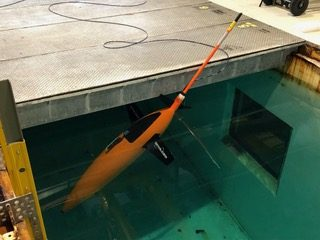
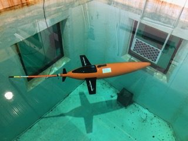
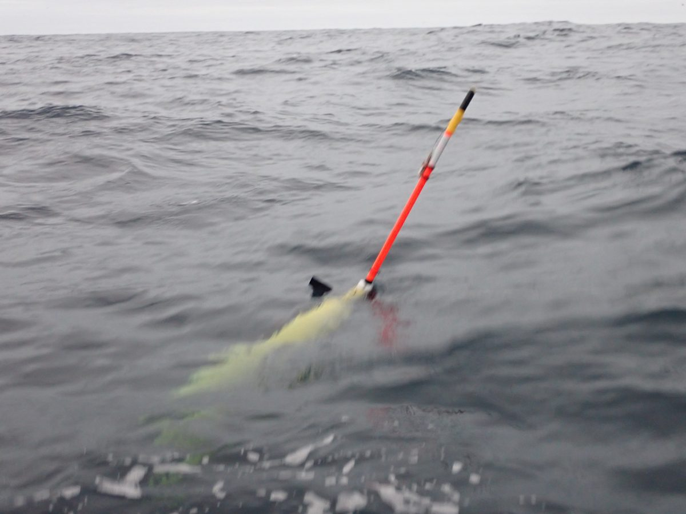

# Seaglider Ballasting Procedure

Before a sea trial, a Seaglider needs enough lead trimmed out (or in) that
its maximum internal volume (`volmax`) gives the right thrust in the density
of the water it's actually deploying into. This page covers the tank
procedure for estimating `volmax` and turning it into a weight change. Once
the glider is in the water, trim is refined dynamically from flight data —
see [Trim & Flight Model](../../piloting/seaglider/trim-and-flight-model.md).

!!! info "Source"
    Paraphrased from the APL-UW IOP office-hours session on ballasting and
    volmax estimation (June 2026) and the APL-UW IOP *SGX Documentation*.
    The tank method is deliberately simple — IOP's own philosophy is to
    nail down `volmax` in the tank and let the sea trial work out pitch/roll
    trim dynamically, rather than trying to model static centers precisely
    on paper. The neutral-point tank test and leash-check sections draw on
    operator service correspondence (2018–2023). Numbers quoted here are
    IOP starting points — confirm against the [Parameter Reference Manual](https://iop-apl-uw.github.io/basestation3/html/Parameter_Reference_Manual.html)
    and defer to APL-UW IOP guidance.

---

## Equipment

- A freshwater tank large enough to fully submerge the glider **vertically**
  (deep enough that it can hang without touching bottom or breaking the
  surface). Around **2 m** is the practical minimum — that is what the
  glider needs to take up its nose-down surface attitude (roughly 60–70°)
  clear of the floor. A 3–4 m tank allows short "dives", but they tell you
  little that the static test doesn't. Shallow above-ground pools (~1.4 m)
  have been used, but they limit what you can check.
- A hanging scale or load cell suspended over the tank, to weigh the glider
  in water.
- A line to suspend the glider from — tied off at the rudder, since it hangs
  vertically.
- The glider's comms cable, connected and slack — you need a live link to
  read/set VBD position while the glider hangs in the tank. Leave the
  antenna disconnected and simply let it dangle; nothing should be
  expressing at the surface.

---

## Procedure

1. **Weigh the whole glider dry** — wings, rudder, everything — on a scale
   in air. This is the mass **M**.
2. **Soak it overnight**, fully submerged and vertical, in the freshwater
   tank. This clears trapped air bubbles and fully saturates the fairings so
   the next day's in-water weight is real.
3. **Compute the tank water density.** In a freshwater tank, temperature
   alone gives you density; a saltwater tank also needs salinity.
4. **Weigh the glider in water** at an intermediate VBD position (e.g. 2000
   A/D counts) — this is **W<sub>i</sub>**. Hang it from the rudder by a
   light line with the comms cable attached and slack, nothing touching the
   tank bottom or breaking the surface.
5. **Compute `volmax`:**

    ```
    volmax = (M − Wi) / ρtank + ($VBD_MIN − VBDi) × VBD_CNV
    ```

    where `VBD_CNV = −0.2453 cc/AD count` (the old rule of thumb is roughly
    **4 A/D counts per cc**), `$VBD_MIN` (~400 counts) is bladder **full**,
    and `$VBD_MAX` (~3960 counts) is bladder **empty** — note the
    counter-intuitive naming: *smaller counts mean more volume*.

6. **Repeat at several VBD positions** — IOP uses five, e.g. 2000, 2250,
   2500, 2750, 3000 counts — and average. They should agree to within about
   ±5–10 cc; if one is a clear outlier, re-check that measurement before
   trusting the average.
7. **Convert to a weight change** using the **Ballast worksheet** in vis:
   feed it the tank `volmax`, plus your target thrust and target deployment
   density, and it returns how much lead to add or remove.

---

!!! warning "This estimate is not precise — plan around it"
    IOP's own tank estimate is only accurate to roughly **±100 cc**. Always
    deploy a glider that has only been tank-ballasted **on a line**, and
    prefer a shallow, enclosed, local first dive over an open-ocean or deep
    first mission — the tank number is a starting point for a sea trial, not
    a guarantee of neutral buoyancy in the field.

---

## Alternative: the neutral-point tank trim test

Instead of (or as well as) weighing in water, many teams trim the glider
**free-floating** in the tank and read off the centers directly. It answers a
slightly different question — "where are neutral and level *for this exact
configuration*?" — and its output feeds straight into the
[trim sheet](trim-sheet-and-reballasting.md#calibrating-the-sheet-the-mystery-mass),
which then extrapolates to ocean density. It's the natural test for a glider
that has just been refitted or refurbished.

**Before the tank**

1. **Inventory the variable ballast.** Weigh and photograph every lead bar
   and foam piece and note where each sits (see
   [inventory](trim-sheet-and-reballasting.md#inventory-the-lead-and-foam-every-time)).
2. **Weigh the wings and rudder** separately, then **weigh the whole glider
   in air** — wings, rudder, every screw. (On one glider the in-air weight
   was off by a single missing screw; it was found because someone looked.)
3. Update the trim sheet with all of the above so you have a **predicted**
   `$C_VBD` and `$C_PITCH` for the tank's density.

**In the tank** — comms cable attached and slack:

1. Lower the glider in with the VBD at maximum buoyancy and work out any
   trapped air.
2. Take **several CTD samples** to get the tank density (temperature alone
   if it's fresh water). Some groups keep their own CTDs out of shared tanks
   because of contamination concerns — cover or isolate sensors if your tank
   isn't clean.
3. **Step the VBD** toward heavy, letting the glider settle at each step,
   until it hangs **neutral mid-water** — neither rising nor sinking. Bracket
   it: overshoot, come back in smaller steps (e.g. 300 → 100 → 0 → −50 →
   −100 → −75 → −85 cc). Record every step.
4. **Move pitch** until the glider sits **level**, again bracketing.
5. **Sweep roll** to both ends and back to centre, and confirm it hangs
   upright at the roll center.
6. Note the observed **`$C_VBD`, `$C_PITCH`, `$C_ROLL`** and the tank
   density. Return VBD to full buoyancy, pitch forward, and run a quick
   sensor check while you have the glider wet.

<figure markdown>
  { width="45%" }
  { width="45%" }
  <figcaption>
    Tank trim test. Left: at full buoyancy with pitch forward, the glider
    takes its nose-down surface attitude — the tank must be deep enough for
    this. Right: VBD and pitch adjusted until it hangs level and neutral
    mid-water; those positions are the observed centers.
  </figcaption>
</figure>

**Comparing observed with predicted.** On one refurbished glider the sheet
predicted `$C_VBD` 2868 / `$C_PITCH` 2754, and the tank gave 2810 / 2843 — a
few tens of counts on VBD, ~90 on pitch. The sea trial that followed, in
water almost the same density as the tank, flew happily at 2868 / 2794.
The basestation's suggestions on that trial ranged further (2934–2972 for
`$C_VBD`) but were based on few dives; treat early suggestions as a
reference, not an instruction. Once the sheet is forced to match the
observed tank centers, it can be used to answer "what if" — e.g. ocean
density plus an extra 100 g of lead gave ~314 cc of maximum thrust for that
glider, which was judged acceptable.

---

## Before the open-water launch: the leash check

Even a careful tank result can be off — one glider's tank test called for
removing 185 g of foam, and at sea it was clearly too heavy. Plan for that:

- **Carry spare foam, lead, and the tools to fit them on deck.** The
  deployment crew should know how to open the fairing and where pieces go.
  If the margin is uncertain, adding a little foam before launch (~50 g)
  is cheaper than a recovery.
- **From a small boat:** with a line still attached, push the glider down by
  the antenna mast to ~5 m and let go. If it comes back up readily and
  settles into a good surface attitude, release it.
- **From a large ship**, where you can't handle the glider in the water to
  clear bubbles: make the **first dive on a long line**, accept that this
  dive is only for purging air, and judge ballast from the dives after.
- **Judge surface attitude knowing the VBD position.** A glider that has
  failed to call or get a GPS fix may keep pumping toward full buoyancy, so
  check where the VBD actually is before deciding. If it sits very low
  (tail fin mostly under) *at full VBD*, it is too heavy — recover and add
  foam. One team added foam in ~60 g steps between checks before launching.
- **Don't over-read the picture.** A correctly ballasted Seaglider floats
  low: most of the hull awash, only the antenna mast and the top of the
  rudder clear. What matters is that the mast stands well out of the water
  at a steep angle — and that no air is trapped to flatter the result.

<figure markdown>
  { width="60%" }
  <figcaption>
    Pre-launch check at sea. The deployment crew worried this looked too
    low; an experienced pilot judged it fine — hull awash, antenna mast
    standing well clear at a steep angle — provided all the air was out. The
    glider launched like this and flew normally.
  </figcaption>
</figure>

For a glider whose first mission has to go ahead without a sea test, at
least run an [autonomous self-test](../../deployment/seaglider/deployment-procedure.md#self-test)
and several [simulated dives](../../piloting/seaglider/dive-cycle-and-control-files.md#deck-dives-simulated-dives),
then update `$MASS`, `$C_VBD` and `$C_PITCH` (and `sg_calib_constants.m`)
from the tank results before shipping.

---

## After the tank: dynamic trim

The tank only gets `volmax` roughly right. Everything else — pitch trim,
roll trim, and refining `volmax` itself — is worked out **dynamically** from
the first dives, using the FMS regressions described on the
[Trim & Flight Model](../../piloting/seaglider/trim-and-flight-model.md#the-trimming-workflow)
page. Expect the physical process (cutting foam, moving lead) to take
several iterations before the glider floats the way you want, the same way
a Slocum typically needs [several tank opens](../slocum/ballasting-procedure.md)
before its ballast is right.
