# Slocum Glider Deployment Procedure

!!! info "For vessel operators and external deployment partners"
    This document is intended to be shared with ship crews, vessel operators, and any external personnel assisting with the deployment of a Slocum G3 glider. It covers unboxing, pre-deployment setup, and launch from both a MOB-boat and a large vessel.

    **Do not power on or deploy the glider without explicit clearance from the glider operations team.** Contact details are in the [Operator Contacts](#operator-contacts) section below.

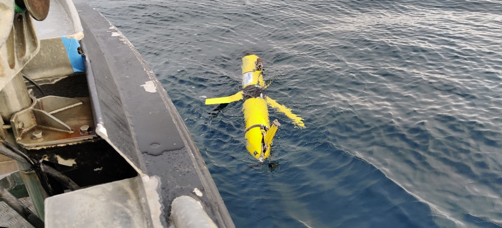

---

## Operator Contacts

!!! note "Update before distributing"
    Replace the contacts below with the relevant personnel for each deployment.

| Role | Name | Phone | Email |
|---|---|---|---|
| Lead Technician | | | |
| Backup Contact | | | |

---

## Unboxing

!!! warning "At least two people required."

Open the crate and lift the top cover clear of the tail fin. Release the two jack straps holding the glider and trolley within the crate. Lift the glider and trolley out as a single unit using the front handle and the aft part of the trolley. Be careful not to damage the propeller.

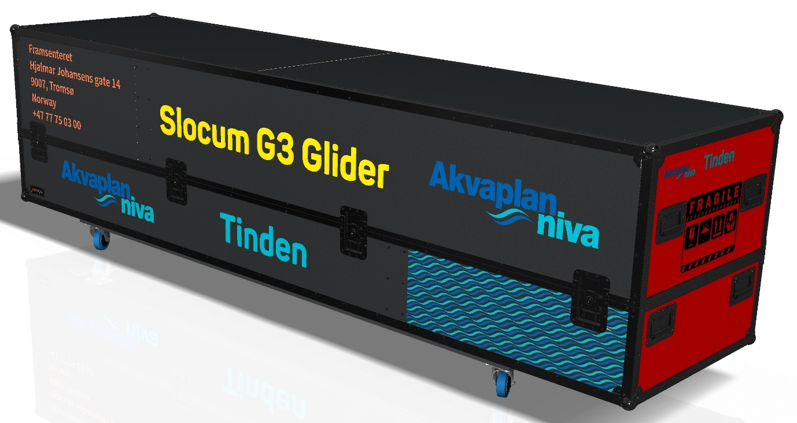

| Crate dimension | Value |
|---|---|
| Length × Width × Height | 320 × 78 × 78 cm |
| Weight (glider inside) | ~150 kg |

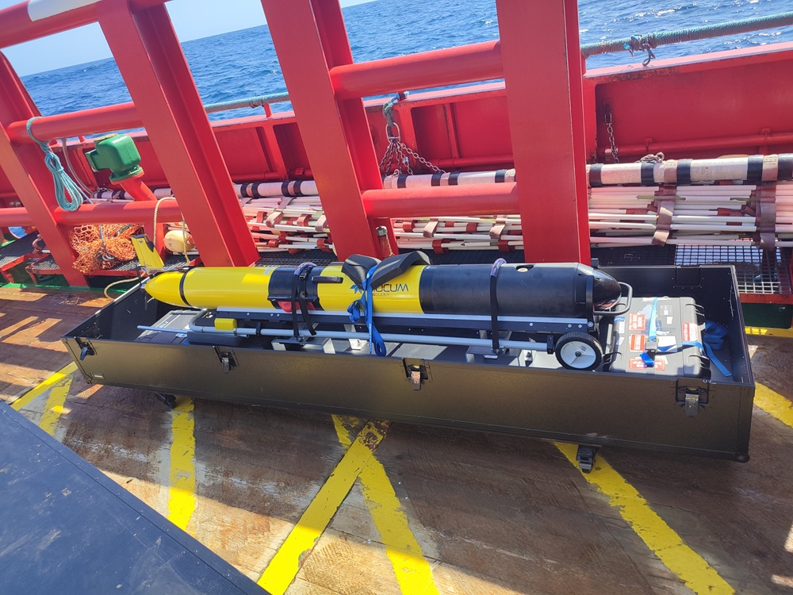

---

## Pre-Deployment

Before proceeding with any of the steps below, confirm that you have established contact with the glider operations team (see [Operator Contacts](#operator-contacts)).

!!! warning "Do not deploy in sea state higher than 3."
    In higher sea states, emergency recovery becomes extremely difficult.

### Aft Bladder

You may be asked to confirm that the aft bladder is inflated or deflated. The bladder sits underneath the spring assembly below the tail fin. A light source may be required to see it — it lies at the bottom of the cover towards the front of the glider.

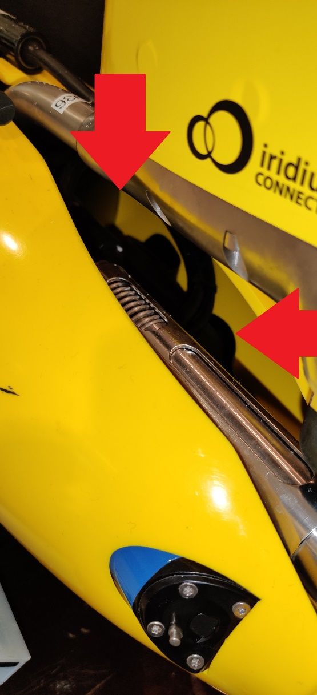
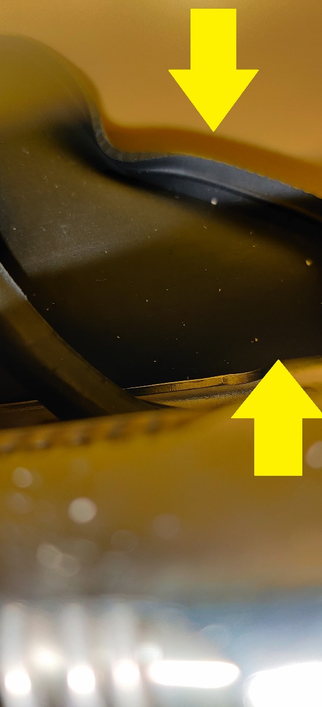

### Turning the Glider On

!!! danger "Only power on when granted "Ready for power on" by the glider operations team."

The green power plug is required.

1. Locate the **POWER** socket just forward of the tail fin.
2. Remove the red power plug by unscrewing the cover and pulling it out.
3. Insert the green power plug by aligning the pins, then push in and screw the cover down hand-tight.

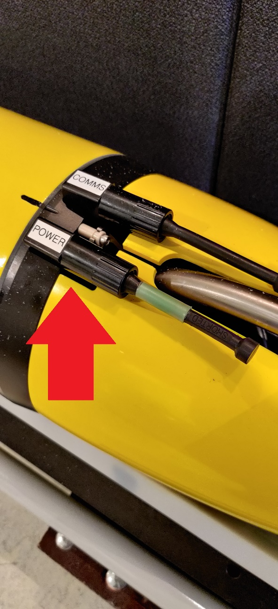
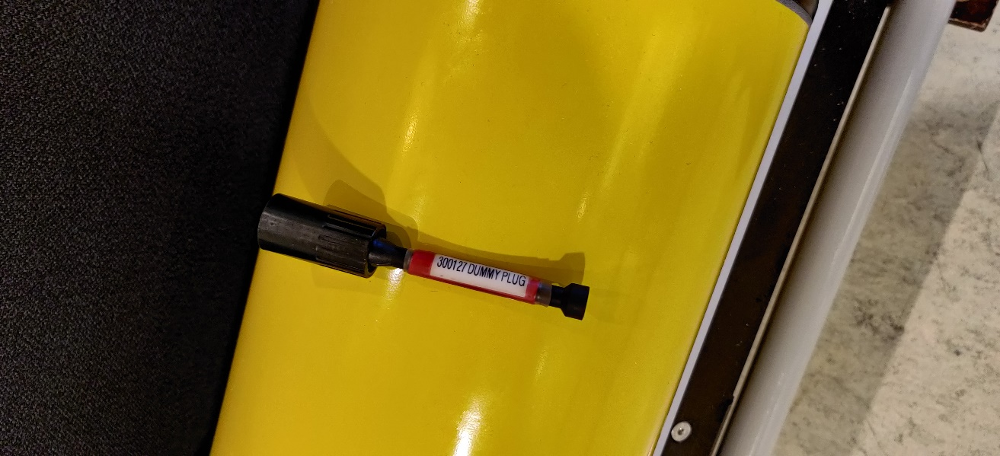

!!! danger "Once the green plug is inserted, do not remove it unless specifically instructed by the glider operations team."

### Wing Attachment

Two wings and a Phillips screwdriver are required.

1. Locate the black module in the middle of the glider — the wing fastening points are on either side.
2. Unscrew the Phillips screw (do not remove it fully).
3. Insert the wing front-end first until it reaches the front latch and the hole aligns with the screw.
4. Press in the back end of the wing until the rear latch clicks into place.
5. Tighten the Phillips screw.
6. Repeat for the other side.

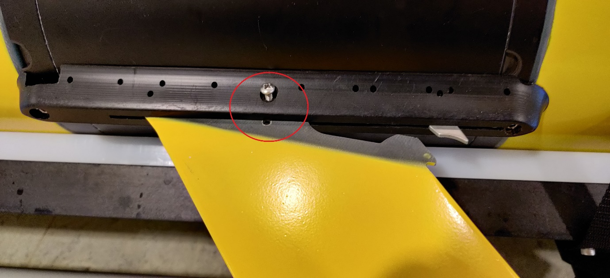
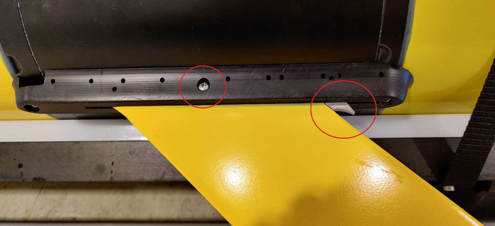

### Moving the Glider Off the Trolley

!!! warning "At least two people required."

1. Remove the strap securing the glider to the trolley.
2. Remove the front handle from the trolley by pulling the securing pins (press the release button at the centre of each pin). Reattach the pins to the handle assembly for safekeeping.
3. Move the glider to the deployment area by placing a firm hand on the tail fin while moving the trolley. The glider may slide.

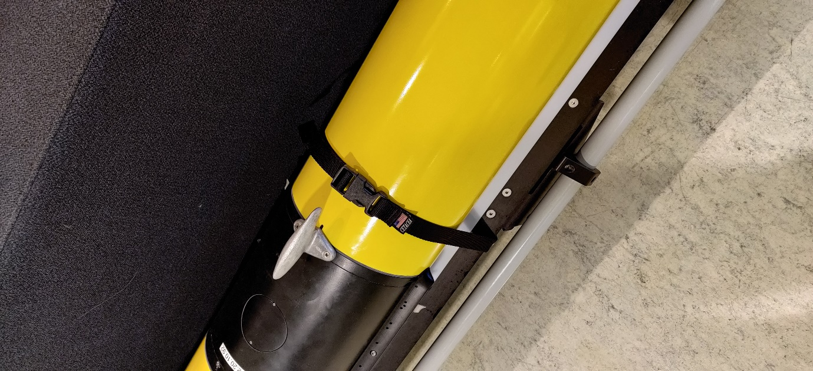
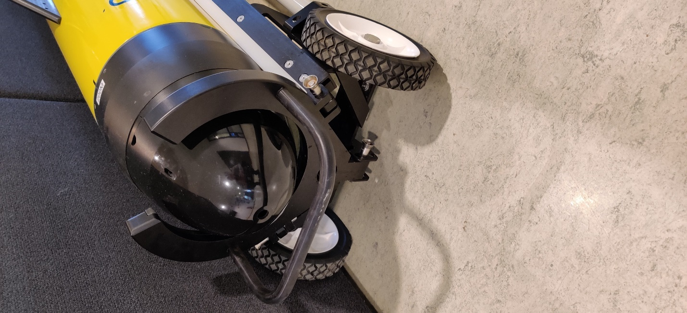
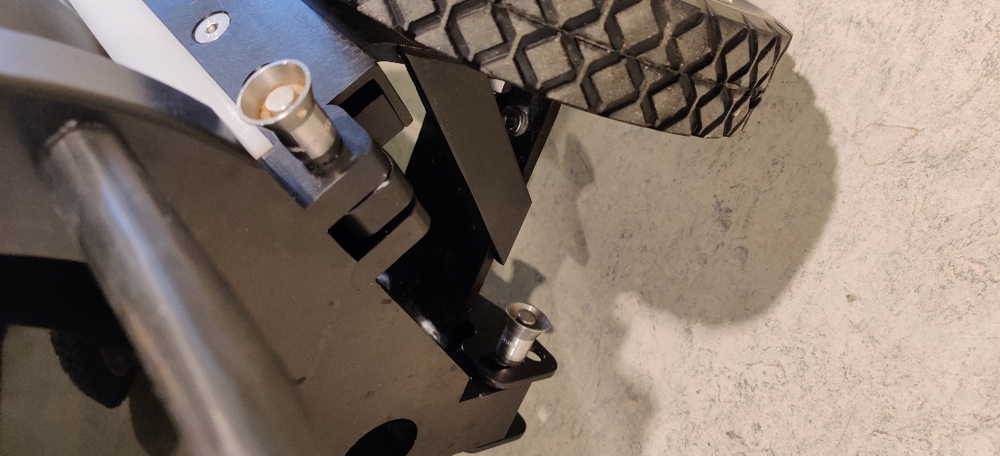

---

## Deployment

### From a MOB-Boat

!!! note "Preferred method when weather allows."

!!! warning "At least two people required. Only proceed when granted "Ready for deployment" by the glider operations team."

The glider weighs approximately 80 kg — additional personnel may be needed to move it to the MOB-boat.

1. Move the glider and trolley to the MOB-boat with the glider facing the water.
2. One person controls the tilt angle of the trolley; a second person holds the tail fin level.
3. Roll the trolley's wheels over the edge and into the water until the nose of the glider is submerged.
4. Once water reaches the hydrophone and the glider is angled approximately 45° or more downward, release the glider.
5. Bring the trolley back out of the water and rinse. Reattach the front handle.

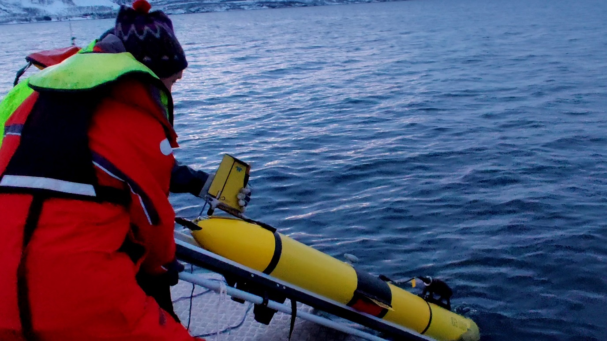

### From a Large Vessel

1. Lift the glider from the tail boom and position two slings underneath — one directly aft of the wings (not on the wing rail or CTD) and one near the hull seal (black stripe).
2. With each sling flat against the hull, take a bite of the long end and push it through the eye on the short end. Insert a pin. Lift the glider and adjust sling length until snug — repeat for the other sling.
3. Adjust slings so they hang vertical when the glider is lifted (the bite should not angle to one side).
4. Thread the trigger line through the pulley and lay it out on deck.
5. Decide on a method to prevent the rig from rotating — options include tying an extended pole to the centre of the T-bar, or attaching tag lines to one or both ends of the beam.
6. Double-check all knots and connections.
7. Connect the top of the beam to the ship crane.
8. Assign roles: (1) crane operator, (2) trigger line, (3) tag lines or centre pole, (4) & (5) guiding the glider overboard from each end.
9. Lift the glider overboard, extend the crane arm as far as practical, and lower to the surface. As soon as the glider touches the water, pull the trigger line.
10. Inform the pilot that deployment is complete.
