# Seaglider Deployment Procedure

!!! info "For field teams and vessel operators"
    This document covers assembling a Seaglider from its shipping crates,
    running self-test, and launching from a small boat. It
    complements the [Seaglider Deployment Checklist](checklists/seaglider-deployment-checklist.md),
    which covers field-kit and pilot sign-off in more general terms — this
    page walks through one real field deployment in more physical detail.

!!! info "Source"
    Paraphrased from a community Seaglider field deployment write-up, including photos from that deployment. Menu
    wording and self-test flow will vary slightly by basestation/firmware
    version — confirm against your own glider's menus.

---

## Tools and Equipment

- Zip ties (preferably long ones)
- Cutter
- Duct tape
- 30 m or longer line (preferably light)
- Laptop
- Satellite phone
- The glider toolbox (shipped in the same box as the glider)

---

## Assembly (if needed)

In case the glider arrives in two boxes: the pressure hull and forward
fairing in one, the aft fairing in a smaller second box. Assembly is a
two-person job.

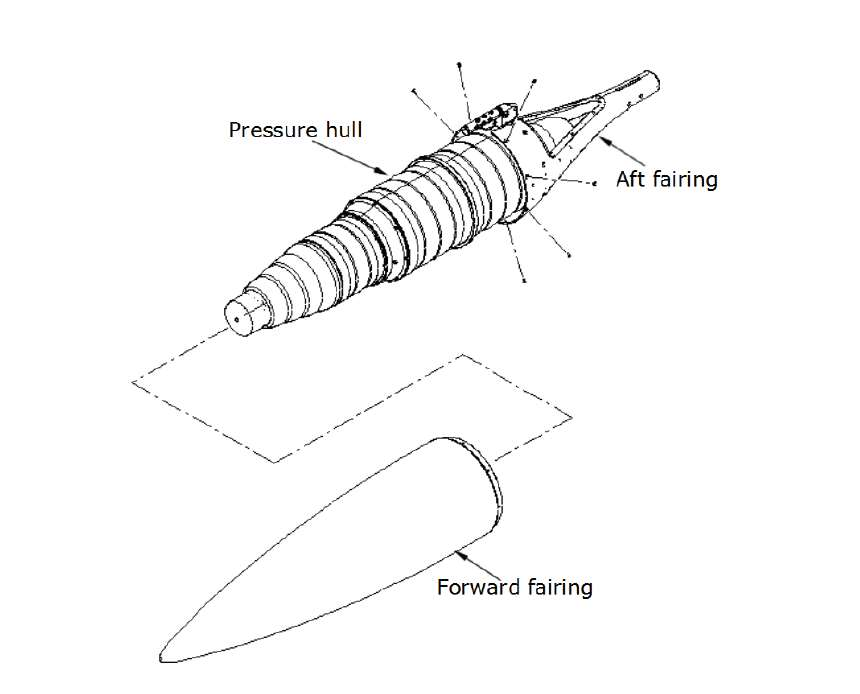

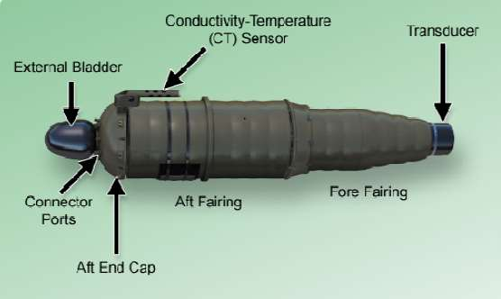

!!! danger "Never lift the glider by the CT sensor"
    It can look like a handle, but it isn't one.

1. Place the pressure hull on a wooden assembly stand, front end on position
   2 and aft end on position 1.
2. Align the aft fairing with the pressure hull and install it with the
   screws from the glider toolbox (10-32 × 3/8").
3. Move the assembly to the other side of the stand so the aft fairing's
   front sits on position 4 and the pressure hull's front sits on position 5.
4. One person pushes the glider's aft down toward position 3 to lift the
   nose clear of position 5, while the other slides the forward fairing on
   and aligns the screw holes — the fairing is marked to show which side is
   "top". Install the screws (10-32 × 3/8").

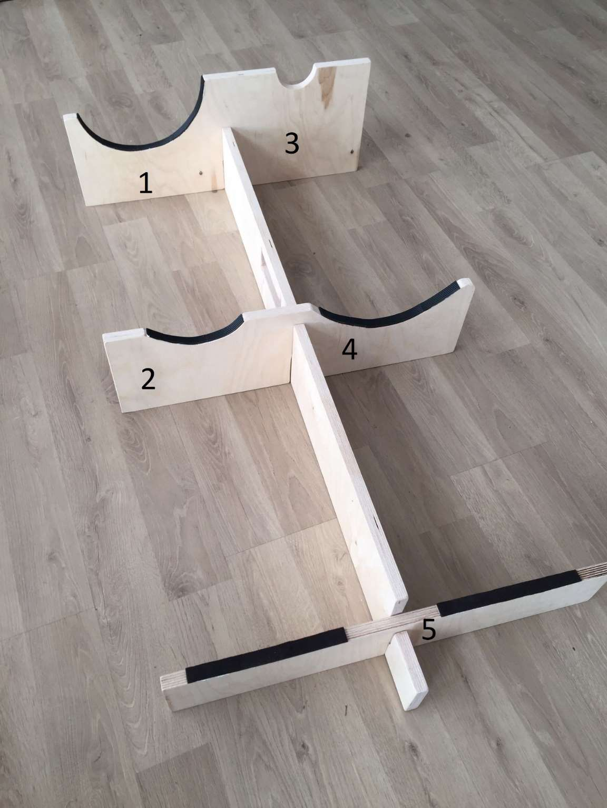

### Sensors and Antenna Cables

1. Remove the hatch (8 screws attaching it to the aft fairing) to access the
   cables.
2. Connect each science sensor to its labeled connector — dummy plugs
   with a black cap mark where a sensor belongs; align the pins carefully
   before hand-tightening the sleeve.
3. Feed the antenna's two cables into the aft fairing, connect the
   communications cable to port A, and connect the antenna to its
   connector. Snug the antenna connector slightly with the locking pliers
   from the toolbox.
4. Reattach the hatch.

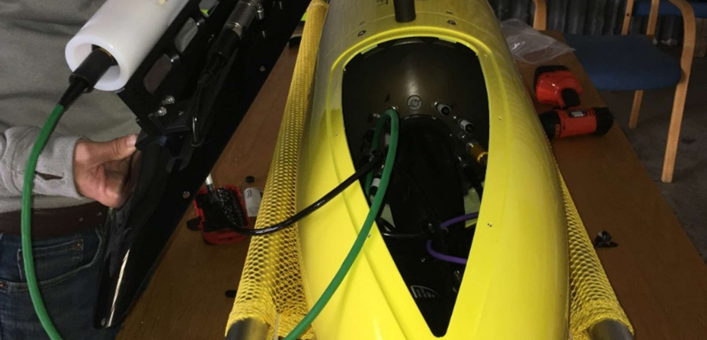

---

## Self-Test

1. Place the glider somewhere with a clear view of the sky, antenna pointed
   up.
2. Remove the dummy plug and connect the communications cable to the
   antenna's connector.
3. Connect the USB cable to a laptop and open a terminal at 9600 8N1 (the
   default for most terminal programs).
4. Wave the magnetic wand over the **ON** marking on the hull.

    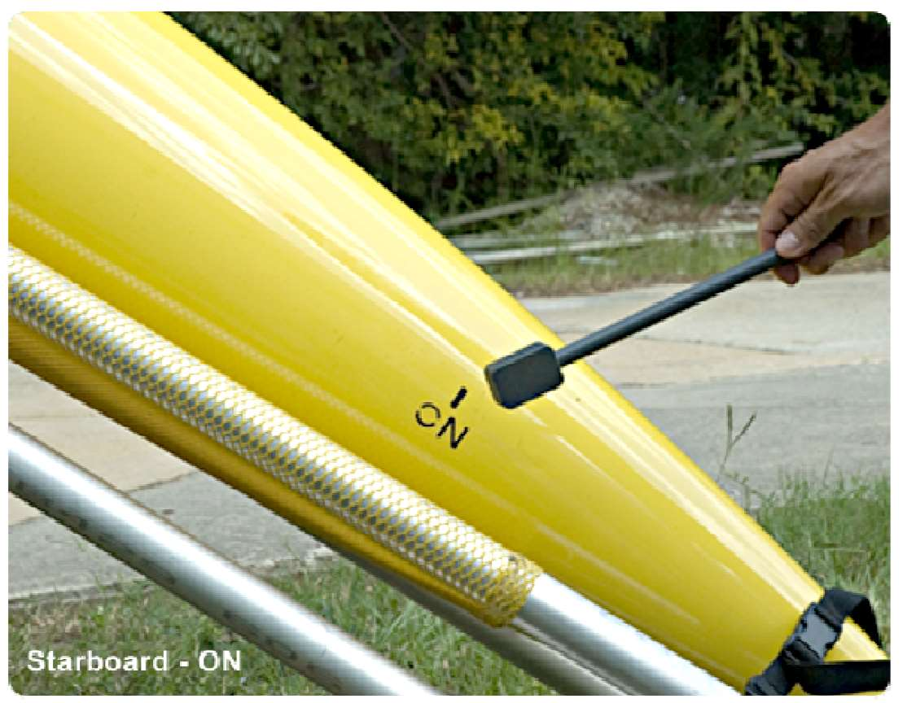

5. Characters should start streaming in the terminal. After a few seconds
   the glider prompts for Enter — otherwise it goes to recovery mode
   automatically.
6. Press Enter, then enter the date/time in GMT as `mm/dd/yyyy hh:mm:ss`.
7. When asked whether you're running on external (bench) power, press Enter.
8. At the Main Menu, select **5 [launch] Pre-launch**, then **3 [autotest]
   Perform autonomous self test**. The glider runs the self-test
   autonomously and sends results to the basestation over satellite —
   allow about 30 minutes.

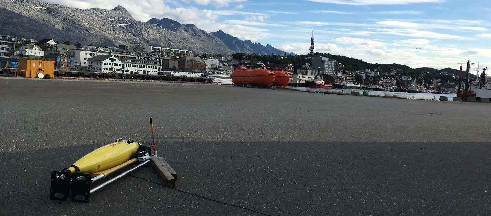

??? note "Example self-test terminal output"
    ```
    ------ Main Menu ------
        1 [param   ] Parameters and configuration
        2 [hw      ] Hardware tests and monitoring
        3 [modes   ] Test operation modes and files
        4 [pdos    ] PicoDOS commands (and exit)
        5 [launch  ] Pre-launch
    Enter selection (1-5,CR): 5

    ------ Launch Menu ------
        1 [scene   ] Set scenario mode
        2 [selftest] Perform interactive self test
        3 [autotest] Perform autonomous self test
        4 [uploadst] Upload self-test results
        5 [reset   ] Reset dive/run number
        6 [test    ] Test Launch!
        7 [sea     ] Sea Launch!
      CR) Return to previous
    Enter selection (1-7,CR): 3
    9.831,SUSR,N,Beginning selftest #63 on glider SG123
    0.115,SUSR,N,Fri Aug  3 09:08:05 2012
    0.207,SUSR,N,---- Audible pings to mark start of tests ----
    ```
    (Example from a different glider/session, shown to illustrate the format.)

---

## Launch

Once self-test succeeds and the pilots give the go-ahead, start the launch
procedure while the communications cable is still connected.

1. If not already there, press **5** for the Launch Menu.
2. Press **7** for **Sea Launch!**. The glider steps through the launch
   dialogue.
3. At *"Can the antenna be used for GPS and Communications? [Y]"*, press
   Enter to accept the default.
4. When asked about changing `$TEL_NUM` / `$ALT_TEL_NUM`, press Enter to
   leave them unchanged.
5. The glider calls the basestation, then asks *"Has pilot given permission
   to launch?"* — contact the pilots and wait for their OK before typing
   **Y**.
6. Wait for the `$QUIT` prompt before disconnecting the cable, then
   reinstall the dummy plug.

---

## Install Antenna, Rudder, and Wings

1. Insert the antenna into the aft fairing — you may need to reopen the
   hatch to guide the cables through — and rotate it so its screws line up
   with the fairing.
2. Slide the rudder through and install its two screws.

    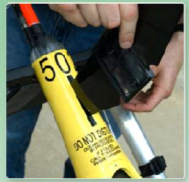
    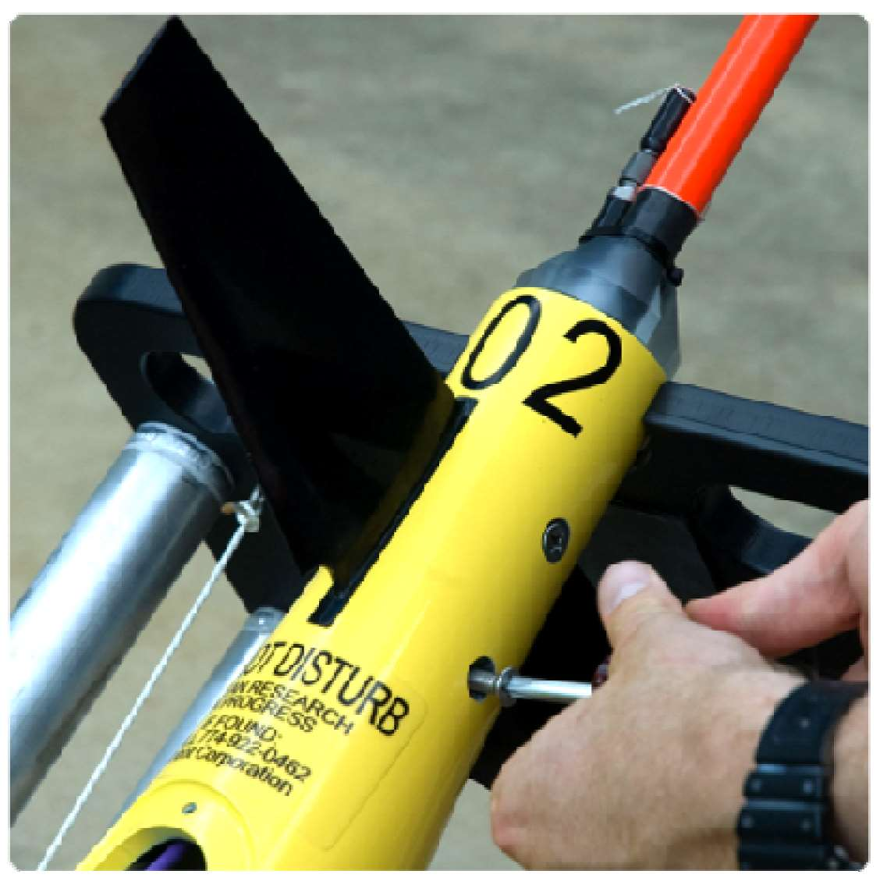

3. Install each wing (marked **Starboard** or **Port**) with four 10-32 ×
   1/2" screws.

    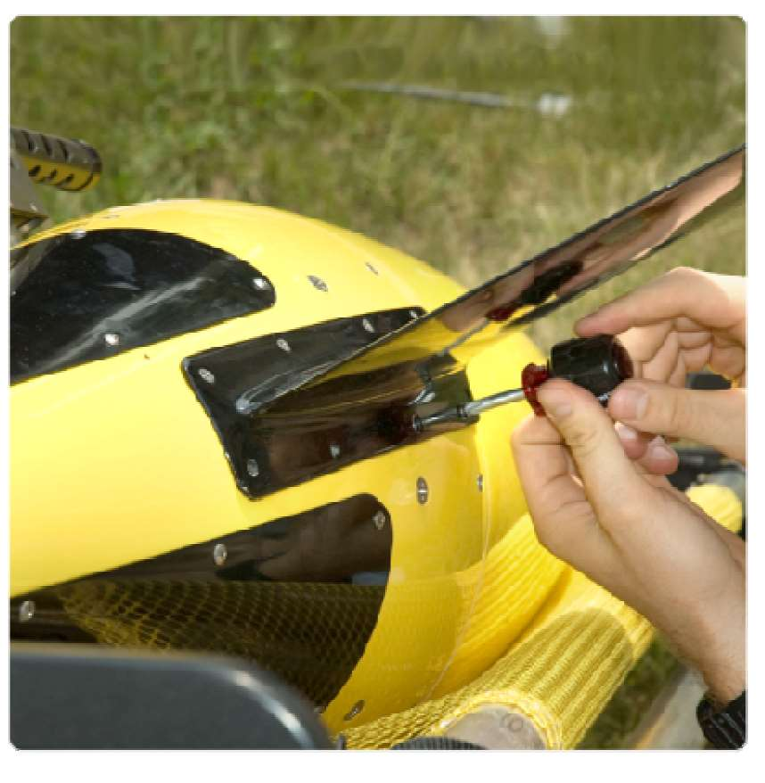

---

## Deploy the Glider in Water

- Have a line ready — 30 m or longer, preferably light.
- Remove all sensor caps if not already done.
- Confirm the pilots are ready before launch.
- With the antenna, rudder, and wings attached and the glider already in
  Sea Launch mode, tie a line around the rudder and lower it slowly into
  the water — pull on the wings and rudder to lift the glider in and out of
  the water, not on anything else.

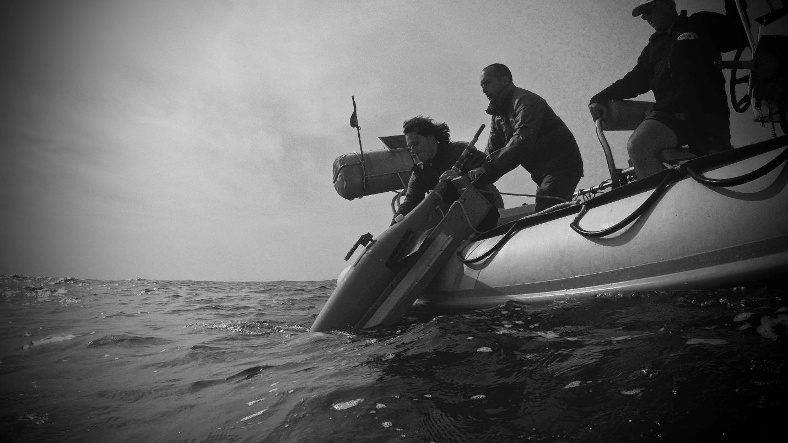

- Once in the water, grab the antenna mast (the orange section below the
  antenna element) and push the glider under briefly to clear trapped air
  bubbles.
- The glider should surface and sit at a 60°+ angle. Report its position to
  the pilots.

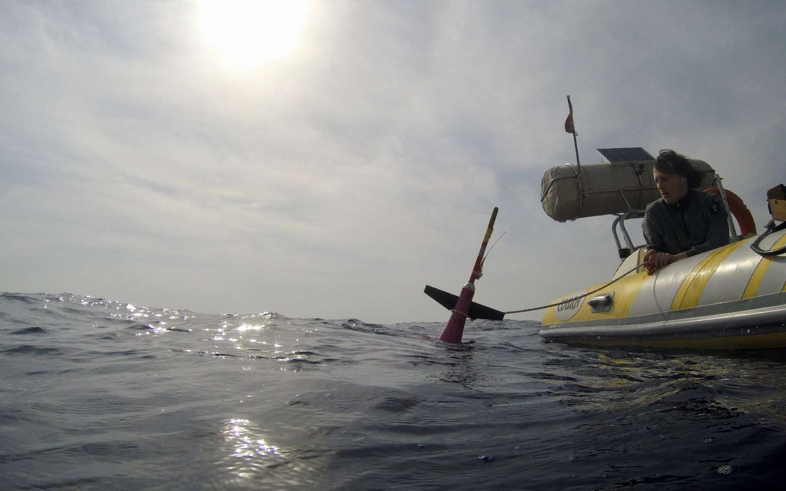

- If the pilots are happy, they'll send the glider for a short tethered
  dive — keep enough slack in the line that it never pulls the glider out
  of the water.
- Once that's done and the pilots give the go-ahead, remove the line; the
  glider will run a few more short dives untethered.
- Once the pilots are confident the glider is flying correctly, the field
  team's job is done and the deployment is successful. If the glider runs
  into trouble at any point, the pilots may ask the field team to recover
  it instead — see [Recovery Procedure](../../recovery/seaglider/recovery-procedure.md).
