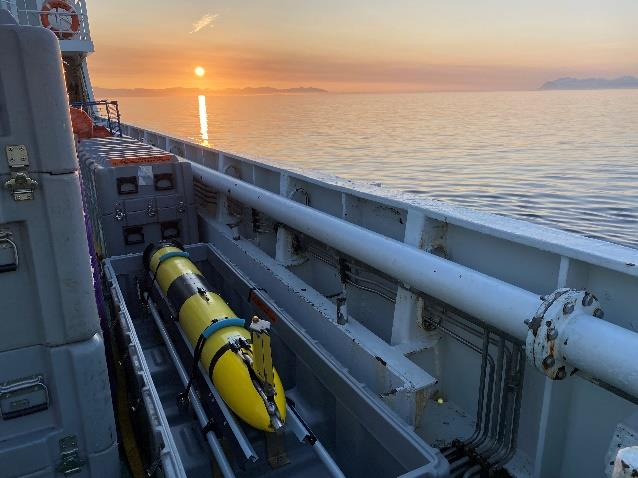
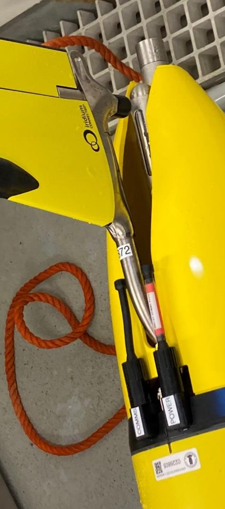
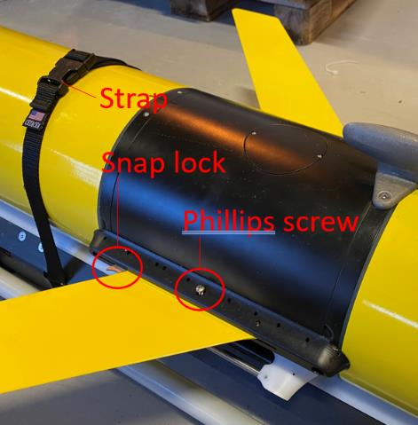
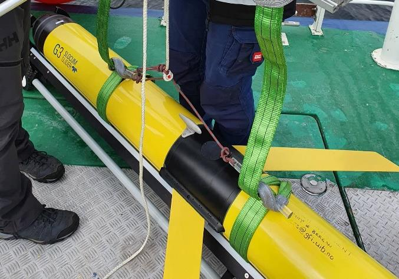
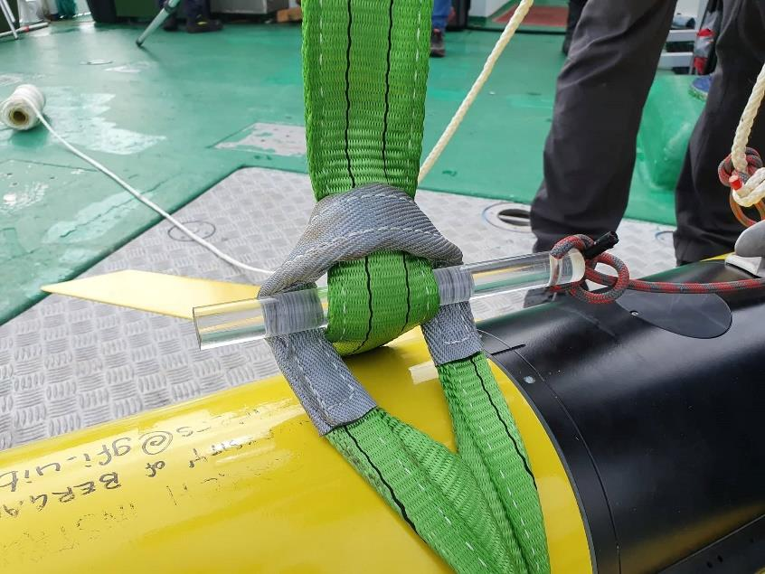
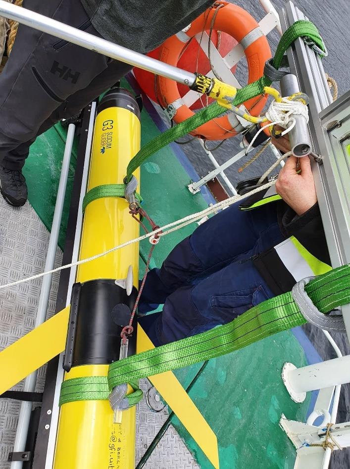
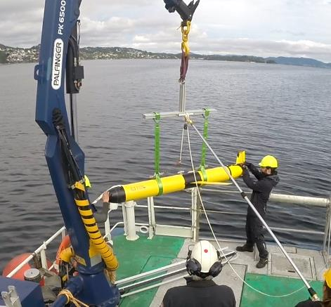
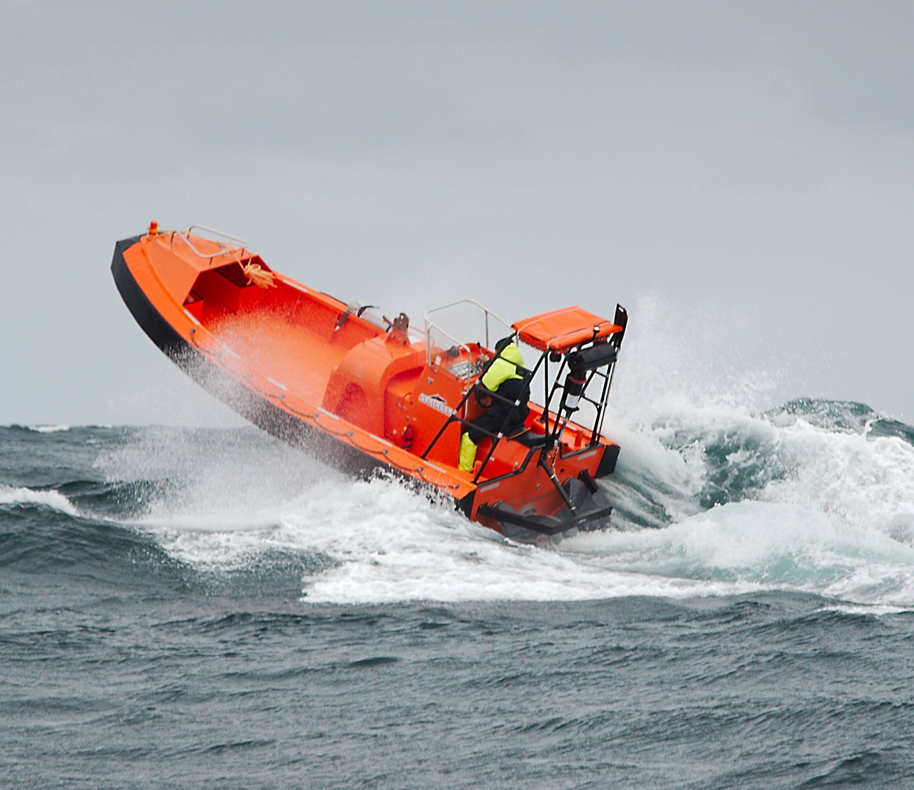
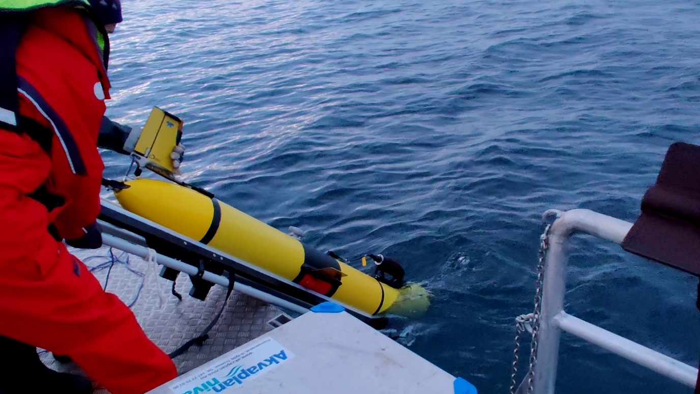
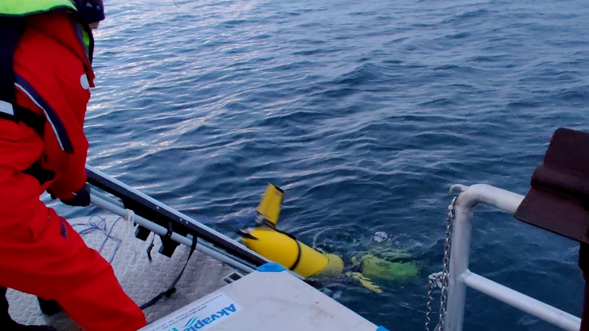

# Slocum Glider Deployment Procedure

!!! info "For vessel operators and external deployment partners"
    This document is intended to be shared with ship crews, vessel operators, and any external personnel assisting with the deployment of a Slocum G3 glider. It covers pre-deployment setup and launch by crane or from a MOB-boat.

    **Do not power on or deploy the glider without explicit clearance from the glider operations team.** Contact details are in the [Operator Contacts](#operator-contacts) section below.

!!! info "Source"
    Paraphrased from NorGliders / University of Bergen (UiB) field procedure
    notes (*SL13 — User Notes — G3 Deployment Field*), including photos from
    that procedure. Specifications below are typical for a **G3 with energy
    bay** — confirm against your specific glider and payload configuration.

---

## Specifications

| Parameter | Value |
|---|---|
| Model | Teledyne Slocum G3 (with energy bay) |
| Length | 2.35 m |
| Diameter of main body | 0.19 m |
| Wingspan | 1.0 m |
| Weight in air | ~63 kg |
| Length of recovery line | 9.1 m |

## Sensitive Areas

!!! warning "How to handle the glider"
    The glider can only be lifted **from the nose** (if vertical) or by
    **choking two slings around the hull** (if horizontal). The tail fin is
    rugged enough to handle and manipulate the glider — e.g. lifting from
    the tail far enough to slip slings underneath — but the **thruster at
    the tail** and the **CTD beneath the starboard wing** must be kept clear
    when handling.

---

## Operator Contacts

!!! note "Update before distributing"
    Replace the contacts below with the relevant personnel for each deployment.

| Role | Name | Phone | Email |
|---|---|---|---|
| Lead Technician | | | |
| Backup Contact | | | |

---

## Pre-Departure Coordination

Before the vessel departs, discuss the following with the glider operations team:

- Estimated date the field team arrives on site, and the likelihood of the
  schedule shifting earlier or later.
- Method of communication between the field team and the operator.
- Equipment the operator is providing.
- Any additional CTD casts or water samples required alongside the deployment.

---

## Pre-Deployment

Before proceeding with any of the steps below, confirm that you have established contact with the glider operations team (see [Operator Contacts](#operator-contacts)).

!!! warning "Do not deploy in sea state higher than 3."
    In higher sea states, emergency recovery becomes extremely difficult.

### Turning the Glider On

!!! danger "Only power on when granted "Ready for power on" by the glider operations team."

**About two hours before the scheduled deployment time**, place the glider
on deck with a clear view of the sky, somewhere it's least likely to pick up
interference from other radio sources — it can stay in its open container
if that's easiest. Two hours gives enough margin for the many Iridium call
drop-outs typical of a research vessel, and for the operations team to run
pre-deployment testing.

The green power plug is required.

1. Clean the green go-plug and apply a small amount of Parker O-ring lube to the connectors.
2. Locate the **POWER** socket just forward of the tail fin.
3. Remove the red power plug by unscrewing the cover and pulling it out.
4. Insert the green power plug by aligning the pins, then push in and screw the cover down hand-tight.

!!! danger "Once the green plug is inserted, do not remove it unless specifically instructed by the glider operations team."

Inform the glider operations team of the time the glider was powered on. If
it can't connect to the satellite, the team may ask you to reposition it on
deck, or ask when the ship will next be stationary — a connection is
sometimes easier to establish when not underway. Wait for the confirmation
**"glider is OK to deploy"** before proceeding, and update the team on when
deployment will start and when the glider hits the water.

### Wing Attachment

Two wings and a Phillips screwdriver are required.

1. Locate the black module in the middle of the glider — the wing fastening points are on either side.
2. Unscrew the Phillips screw (do not remove it fully).
3. Insert the wing front-end first until it reaches the front latch and the hole aligns with the screw.
4. Press in the back end of the wing until the rear latch clicks into place.
5. Tighten the Phillips screw.
6. Repeat for the other side.

---

## Deployment

### Crane Deployment

While waiting for the pilot to finish onboard tests, the field team can set
up most of the rigging below. Consider testing the trigger-line release
beforehand with a length of wood standing in for the glider.

On most research vessels the glider is deployed from the port or starboard
side while the vessel is underway at 1–3 kt, pointing into the wind.

1. Lift the glider from the tail boom and position two slings underneath — one directly aft of the wings (not on the wing rail or CTD) and one near the hull seal (black stripe).

    

2. With each sling flat against the hull, take a bite of the long end and push it through the eye on the short end. Insert a pin. Lift the glider and adjust sling length until snug — repeat for the other sling.

    

3. Adjust slings so they hang vertical when the glider is lifted (the bite should not angle to one side).
4. Thread the trigger line through the pulley and lay it out on deck.
5. Decide on a method to prevent the rig from rotating — options include tying an extended pole to the centre of the T-bar, or attaching tag lines to one or both ends of the beam. Note this is only to stop rotation, not to stabilize the swing during deployment.
6. Double-check all knots and connections.
7. Connect the top of the beam to the ship crane.

    

8. Assign roles: (1) crane operator, (2) trigger line, (3) tag lines or centre pole, (4) & (5) guiding the glider overboard from each end.
9. Lift the glider overboard, extend the crane arm as far as practical, and lower to the surface. As soon as the glider touches the water, pull the trigger line.

    

10. Inform the pilot that deployment is complete.

### MOB-Boat Deployment

!!! note "Preferred method when weather allows."

!!! warning "At least two people required. Only proceed when granted "Ready for deployment" by the glider operations team."

The glider weighs approximately 80 kg — additional personnel may be needed to move it to the MOB-boat.

1. Move the glider and trolley to the MOB-boat with the glider facing the water.
2. One person controls the tilt angle of the trolley; a second person holds the tail fin level.
3. Roll the trolley's wheels over the edge and into the water until the nose of the glider is submerged.
4. Once water reaches the hydrophone and the glider is angled approximately 45° or more downward, release the glider.
5. Bring the trolley back out of the water and rinse. Reattach the front handle.

