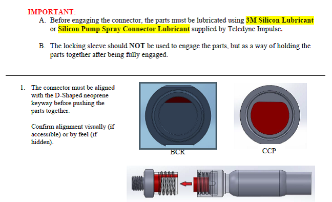
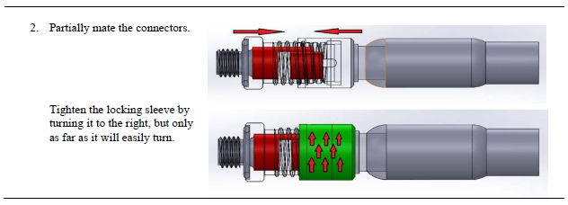
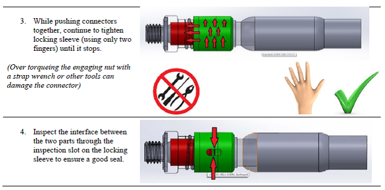
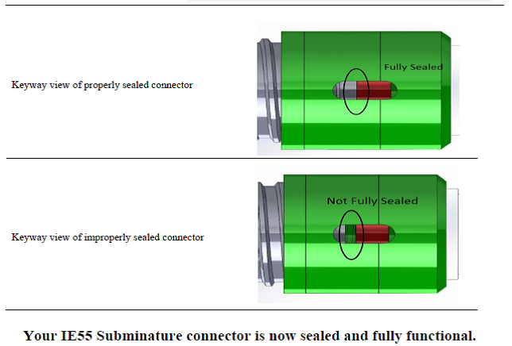

# IE55 One-Pager

Quick-reference mating and inspection procedure for the **Teledyne Impulse IE55 subminature** connector.

*Source: Teledyne Impulse IE55 inspection instructions.*

---

!!! important "Read before mating"
    1. Before engaging the connector, the parts **must be lubricated** using **3M Silicon Lubricant** or **Silicon Pump Spray Connector Lubricant** supplied by Teledyne Impulse.
    2. The locking sleeve should **NOT** be used to engage the parts — only to hold the parts together **after** they are fully engaged.

---

## Mating Procedure

### 1. Align the keyway

The connector must be aligned with the **D-shaped neoprene keyway** before pushing the parts together. Confirm alignment **visually** (if accessible) or **by feel** (if hidden).

### 2. Partially mate, then start the sleeve

Partially mate the connectors. Tighten the locking sleeve by turning it to the **right**, but only as far as it will **easily** turn.

### 3. Push together and hand-tighten

While pushing the connectors together, continue to tighten the locking sleeve — **using only two fingers** — until it stops.

!!! danger "Do not over-torque"
    Over-torquing the engaging nut with a **strap wrench or other tools** can damage the connector. **Hand-tighten only.**

### 4. Inspect the seal

Inspect the interface between the two parts through the **inspection slot** on the locking sleeve to ensure a good seal.

| Keyway view | Result |
|---|---|
| No gap visible at the interface | **Fully sealed** ✅ |
| Gap visible at the interface | **Not fully sealed** ❌ — re-mate and re-inspect |

!!! success "Done"
    Your IE55 subminature connector is now sealed and fully functional.
