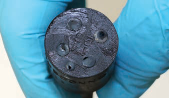
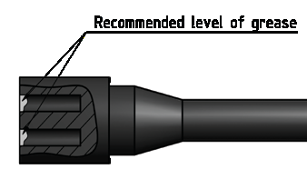
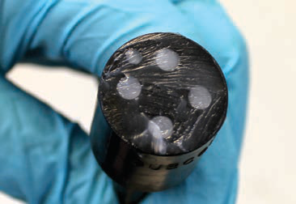
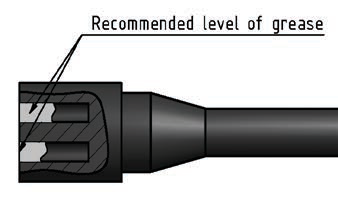
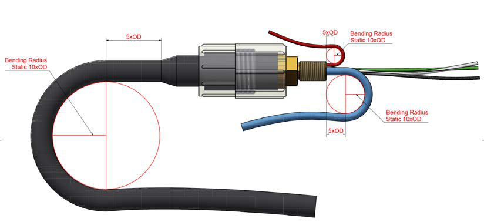

# SubConn® One-Pager

Quick-reference handling instructions for MacArtney **SubConn®** underwater connectors. Follow these carefully to ensure correct use and a reliable seal.

*Source: MacArtney SubConn® handling instructions, Edition 5.1.2.*

---

## Handling

- Connectors must be greased with **MOLYKOTE® 44 Medium** before every mating.
- Always grease O-rings on **BH, BCR, and FCR** connectors with **Molykote 111**.
- Disconnect by pulling **straight out**, not at an angle.
- Do **not** pull on the cable, and avoid sharp bends at the cable entry.
- When using a bulkhead connector, ensure there are **no angular loads**.
- Apply the **recommended torque** when tightening bulkhead nuts.
- Do not expose connectors to extended heat or direct sunlight. If a connector becomes very dry, soak it in fresh water before use.
- All current ratings are based on the connector being **submerged in water**.
- The locking sleeve must be **hand-tightened only**.

---

## Greasing & Mating Above Water (Dry-Mate)

{ width="48%" }
{ width="48%" }

- Grease with **MOLYKOTE® 44 Medium** before every mating.
- Apply a layer of grease corresponding to approximately **1/3 of a socket depth** to the female connector.
- All sockets should be **completely sealed**, with a transparent layer of grease left visible on the face of the connector.
- After greasing, fully mate the male and female connector and **remove any excess grease** from the connector joint.

---

## Greasing & Mating Under Water (Wet-Mate)

{ width="48%" }
{ width="48%" }

- Grease with **MOLYKOTE® 44 Medium** before every mating.
- Apply a layer of grease corresponding to a **minimum of 1/10 of the socket depth** to the female connector.
- The **inner edge of all sockets** should be completely covered, with a thin layer of grease left visible on the face of the connector.
- After greasing, fully mate the connectors to secure optimal distribution of grease on all contacts and in the sockets.
- To confirm sufficient grease, **de-mate and check for grease on every male contact**, then re-mate.

---

## Greasing Products

| Product | Use |
|---|---|
| **Molykote 44 Medium** | Greasing connector contacts before every mating |
| **Molykote 111 Compound** | Greasing O-rings (BH, BCR, FCR connectors) |

---

## Cleaning

- General cleaning: **liquid soap and hot water**.
- For accumulated contamination, use a **spray-based contact cleaner (isopropyl alcohol)**.
- **New grease must be applied again prior to mating.**

---

## Thread Locking

- All threads must be **clean and free of foreign particles**; ensure the threaded hole is clean too.
- For **metallic** connectors, use **LOCTITE® 243**.
- For **non-metallic (PEEK)** connectors, always use **LOCTITE® 5910**.

!!! warning "PEEK and acetone"
    **Acetone creates stress-induced cracking in PEEK material.** Do not use it on PEEK connectors.

---

## Cable Bending Radius

- Recommended dynamic bending radius: **5 × cable OD**.
- Static bending radius: **10 × cable OD**.
- Avoid sharp bends at the cable entry to the connector.

---

## Coax & Oil-Compensated Systems

- Coax connectors are **dry-mate only** — not suitable for open-face pressure or water-block applications.
- Locking sleeves are required; a **dummy connector** is required when coax connectors are unmated.
- When greasing coax, grease **only the rubber parts** — never the coax contact itself. After greasing, de-mate to confirm grease on every male contact and none on the coax, then re-mate.
- For oil-compensated / pressure-balanced systems, MacArtney recommends **DC-200/350 or PMX-200/350** oil.
