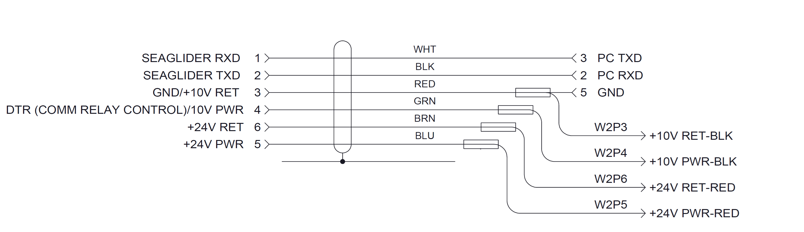

# Pinouts

Pin assignments and wiring diagrams for the connector and comms cables used on glider systems. Use these when building, testing, or troubleshooting a cable.

---

## IE55

### Seaglider Comms Cable Pinout

| IE55 pin | Signal | Wire colour | Destination |
|---|---|---|---|
| 1 | SEAGLIDER RXD | WHT | PC TXD (pin 3) |
| 2 | SEAGLIDER TXD | BLK | PC RXD (pin 2) |
| 3 | GND / +10 V RET | RED | GND (pin 5) |
| 4 | DTR (comm relay control) / 10 V PWR | GRN | — |
| 5 | +24 V PWR | BLU | W2P4 +10 V PWR-BLK / W2P5 +24 V PWR-RED |
| 6 | +24 V RET | BRN | W2P3 +10 V RET-BLK / W2P6 +24 V RET-RED |
