# Glider Components

Platform-specific documentation for underwater glider hardware: sensors, subsystems, and ancillary equipment.

## Platforms

-   { .platform-icon }

    **Seaglider**

    ---

    Sensors, subsystems, and equipment for the Seaglider platform.

    [:octicons-arrow-right-24: Seaglider Components](seaglider/index.md)

-   { .platform-icon }

    **Slocum**

    ---

    Sensors, subsystems, and equipment for the Slocum glider platform.

    [:octicons-arrow-right-24: Slocum Components](slocum/index.md)

-   :material-share-variant:{ .lg .middle } **Shared**

    ---

    Components and equipment used across multiple glider platforms — connectors, CTD, and more.

    [:octicons-arrow-right-24: Shared Components](shared/index.md)

## Knowledge Map

```mermaid
flowchart LR

GC["Glider Components"]
docs_glider_components_seaglider["Seaglider"]
GC --> docs_glider_components_seaglider
docs_glider_components_seaglider_altimeter["Altimeter"]
docs_glider_components_seaglider --> docs_glider_components_seaglider_altimeter
docs_glider_components_seaglider_batteries["Batteries"]
docs_glider_components_seaglider --> docs_glider_components_seaglider_batteries
docs_glider_components_seaglider_vbds["Vbds"]
docs_glider_components_seaglider --> docs_glider_components_seaglider_vbds
docs_glider_components_shared["Shared"]
GC --> docs_glider_components_shared
docs_glider_components_shared_connectors["Connectors"]
docs_glider_components_shared --> docs_glider_components_shared_connectors
docs_glider_components_shared_connectors_guides["Guides"]
docs_glider_components_shared_connectors --> docs_glider_components_shared_connectors_guides
docs_glider_components_slocum["Slocum"]
GC --> docs_glider_components_slocum
docs_glider_components_slocum_altimeter["Altimeter"]
docs_glider_components_slocum --> docs_glider_components_slocum_altimeter
docs_glider_components_slocum_altimeter_guides["Guides"]
docs_glider_components_slocum_altimeter --> docs_glider_components_slocum_altimeter_guides
docs_glider_components_slocum_argos["Argos"]
docs_glider_components_slocum --> docs_glider_components_slocum_argos
docs_glider_components_slocum_batteries["Batteries"]
docs_glider_components_slocum --> docs_glider_components_slocum_batteries
docs_glider_components_slocum_batteries_checklists["Checklists"]
docs_glider_components_slocum_batteries --> docs_glider_components_slocum_batteries_checklists
docs_glider_components_slocum_batteries_guides["Guides"]
docs_glider_components_slocum_batteries --> docs_glider_components_slocum_batteries_guides
docs_glider_components_slocum_batteries_primary["Primary"]
docs_glider_components_slocum_batteries --> docs_glider_components_slocum_batteries_primary
docs_glider_components_slocum_batteries_rechargeable["Rechargeable"]
docs_glider_components_slocum_batteries --> docs_glider_components_slocum_batteries_rechargeable
docs_glider_components_slocum_compass["Compass"]
docs_glider_components_slocum --> docs_glider_components_slocum_compass
docs_glider_components_slocum_digifin["Digifin"]
docs_glider_components_slocum --> docs_glider_components_slocum_digifin
docs_glider_components_slocum_freewave["Freewave"]
docs_glider_components_slocum --> docs_glider_components_slocum_freewave
docs_glider_components_slocum_iridium["Iridium"]
docs_glider_components_slocum --> docs_glider_components_slocum_iridium
docs_glider_components_slocum_o_rings["O Rings"]
docs_glider_components_slocum --> docs_glider_components_slocum_o_rings
docs_glider_components_slocum_pitch["Pitch"]
docs_glider_components_slocum --> docs_glider_components_slocum_pitch
docs_glider_components_slocum_pumps["Pumps"]
docs_glider_components_slocum --> docs_glider_components_slocum_pumps
docs_glider_components_slocum_pumps_deep_pump["Deep Pump"]
docs_glider_components_slocum_pumps --> docs_glider_components_slocum_pumps_deep_pump
docs_glider_components_slocum_pumps_shallow_pump["Shallow Pump"]
docs_glider_components_slocum_pumps --> docs_glider_components_slocum_pumps_shallow_pump
docs_glider_components_slocum_thruster["Thruster"]
docs_glider_components_slocum --> docs_glider_components_slocum_thruster
docs_glider_components_slocum_tie_rod["Tie Rod"]
docs_glider_components_slocum --> docs_glider_components_slocum_tie_rod

click docs_glider_components_seaglider "/Glider-Operation-Best-Practices/glider-components/seaglider/"
click docs_glider_components_seaglider_altimeter "/Glider-Operation-Best-Practices/glider-components/seaglider/altimeter/"
click docs_glider_components_seaglider_batteries "/Glider-Operation-Best-Practices/glider-components/seaglider/batteries/"
click docs_glider_components_seaglider_vbds "/Glider-Operation-Best-Practices/glider-components/seaglider/vbds/"
click docs_glider_components_shared "/Glider-Operation-Best-Practices/glider-components/shared/"
click docs_glider_components_shared_connectors "/Glider-Operation-Best-Practices/glider-components/shared/connectors/"
click docs_glider_components_shared_connectors_guides "/Glider-Operation-Best-Practices/glider-components/shared/connectors/"
click docs_glider_components_slocum "/Glider-Operation-Best-Practices/glider-components/slocum/"
click docs_glider_components_slocum_altimeter "/Glider-Operation-Best-Practices/glider-components/slocum/altimeter/"
click docs_glider_components_slocum_altimeter_guides "/Glider-Operation-Best-Practices/glider-components/slocum/altimeter/"
click docs_glider_components_slocum_argos "/Glider-Operation-Best-Practices/glider-components/slocum/argos/"
click docs_glider_components_slocum_batteries "/Glider-Operation-Best-Practices/glider-components/slocum/batteries/"
click docs_glider_components_slocum_batteries_checklists "/Glider-Operation-Best-Practices/glider-components/slocum/batteries/"
click docs_glider_components_slocum_batteries_guides "/Glider-Operation-Best-Practices/glider-components/slocum/batteries/"
click docs_glider_components_slocum_compass "/Glider-Operation-Best-Practices/glider-components/slocum/compass/"
click docs_glider_components_slocum_digifin "/Glider-Operation-Best-Practices/glider-components/slocum/digifin/"
click docs_glider_components_slocum_freewave "/Glider-Operation-Best-Practices/glider-components/slocum/freewave/"
click docs_glider_components_slocum_iridium "/Glider-Operation-Best-Practices/glider-components/slocum/iridium/"
click docs_glider_components_slocum_o_rings "/Glider-Operation-Best-Practices/glider-components/slocum/o-rings/"
click docs_glider_components_slocum_pitch "/Glider-Operation-Best-Practices/glider-components/slocum/pitch/"
click docs_glider_components_slocum_pumps "/Glider-Operation-Best-Practices/glider-components/slocum/pumps/"
click docs_glider_components_slocum_thruster "/Glider-Operation-Best-Practices/glider-components/slocum/thruster/"
click docs_glider_components_slocum_tie_rod "/Glider-Operation-Best-Practices/glider-components/slocum/tie-rod/"
```

<!-- COMPONENT_MAP_START -->

<!-- COMPONENT_MAP_END -->

