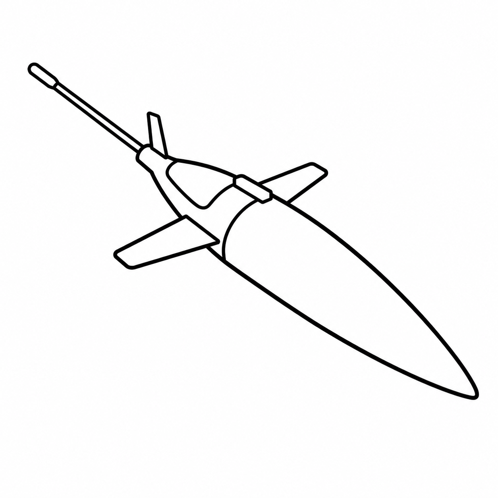

# Seaglider Components

{ .platform-banner }

Documentation for Seaglider hardware components and subsystems.

## In This Section

-   :material-battery: **Batteries**

    ---

    Charging procedures, storage, safe handling, and capacity tracking.

    [:octicons-arrow-right-24: Batteries](batteries/index.md)

-   :material-altimeter: **Altimeter**

    ---

    Installation, configuration, altitude settings, and performance verification.

    [:octicons-arrow-right-24: Altimeter](altimeter/index.md)

-   :material-pump: **VBD**

    ---

    The buoyancy engine: reservoir, bladder, boost and main pumps, the Skinner valve, the VBD budget, and lab procedures for air-bleeding and pump cycling.

    [:octicons-arrow-right-24: VBD](vbds/index.md)

