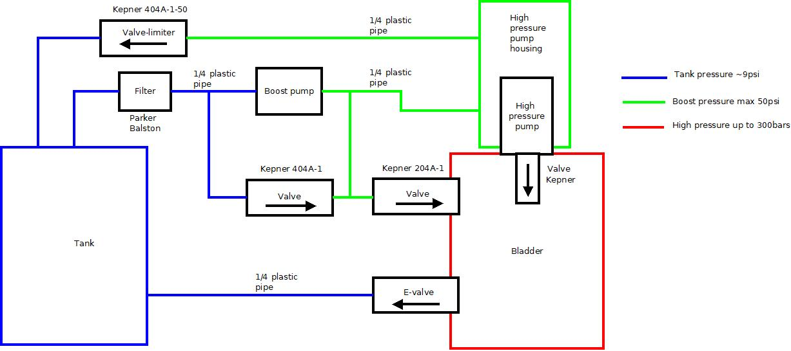
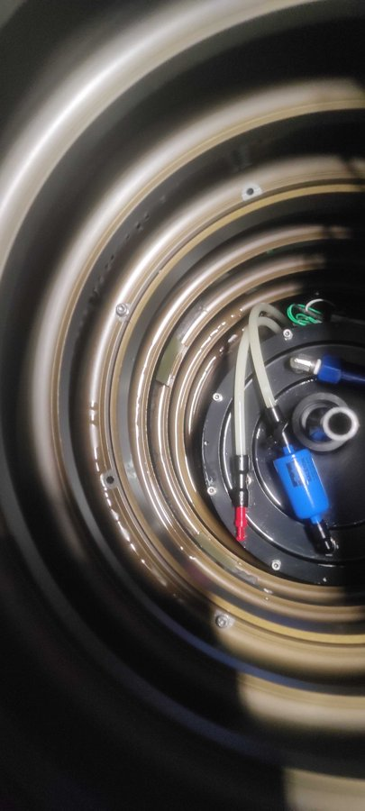

# VBD (Variable Buoyancy Device)

The VBD is the Seaglider's buoyancy engine and the reason it moves at all: a
hydraulic system in the aft endcap that moves low-viscosity oil between an
**internal reservoir** inside the pressure hull and an **external bladder**
outside the hull (but inside the fairing). Pumping oil out increases the
glider's displaced volume without changing its mass — it gets lighter than the
water and climbs; bleeding oil back in shrinks it and it sinks. It is also the
single largest energy consumer on the vehicle, so most piloting-for-endurance
decisions are ultimately VBD decisions.

!!! info "Source"
    Paraphrased from the APL-UW IOP *SGX Documentation* (v1.0, 2024), the
    manufacturer's air-bleed procedure (support correspondence, 2018), the
    community "Cycletron in Pupa" pump-cycling notes, IOP webinar/office
    hours material, and 2018–2024 field and refurbishment correspondence
    between Seaglider operators, APL-UW IOP and service providers (VBD
    rebuilds, seal failures), and 2017–2023 manufacturer
    support correspondence (cycletron analysis, cold-water pump rates). Hardware details vary
    between SG, SGX, and Deepglider variants and build years — defer to
    APL-UW IOP and your glider's documentation.

---

## What's in the system

| Element | Role |
|---------|------|
| **Internal reservoir ("bellofram")** | A rolling-diaphragm oil reservoir inside the pressure hull; its piston position *is* the VBD position |
| **External bladder** | Holds the oil that increases displacement; sits outside the hull under the aft fairing |
| **Boost pump** | Low-pressure pump that feeds the main pump; runs only at depth, on the ascent side (older SGs used a *high*-pressure boost pump with different plumbing) |
| **Main pump** | High-pressure axial-piston pump that pushes oil out to the bladder against sea pressure |
| **Skinner valve** | Magnetically latching solenoid valve that meters oil (bleeds) from bladder back to reservoir |
| **Check valves (×3)** | 1–5 psi valves that fix flow direction and rate within the circuit |
| **Two linear potentiometers** | Report the reservoir piston position; the two readings can differ by up to a few hundred counts from piston wobble, so their **average** is used |

!!! danger "Boost-pump parameters on older (non-Enhanced) buoyancy engines"
    Two generations of plumbing exist. **Enhanced Buoyancy** engines (the
    shallow-water-capable design) have a bypass so the main pump can run
    without the boost pump, plus a larger boost pump that covers greater
    depths alone. On engines **without** that upgrade there is no bypass —
    if the boost pump shuts off while the main pump runs, the main pump has
    to drag oil through the idle boost stage and the engine can be damaged.
    On those gliders the vendor service bulletin requires `$T_BOOST,0` (boost
    always runs with the main pump) and `$D_BOOST` no greater than **5 m**
    (boost-only operation confined to the near-surface). Know which engine
    you have before touching either parameter.

### A few component details worth knowing

- **Main pump** — a commercial rotary piston pump (Hydro Leduc base)
  modified for the Seaglider (flats machined on the shaft for the motor
  coupling). Its shaft is sealed by a **magnetically coupled shaft seal**
  ("mag seal"); oil weeping from the top bearing means that seal needs
  replacing — see [Oil leaks and the mag seal](#oil-leaks-and-the-mag-seal).
- **Main-pump return line** — carries the pump-body overflow from the
  low-pressure feed back to the reservoir. Air seen in it is cavitation from
  the pump pistons; it collects in the internal reservoir and comes out at
  the bleed screw (reservoir horizontal, bleed port tilted to the highest
  point).
- **Skinner (bleed) valve** — driven by a magnetically latching relay: one
  pulse opens it, another closes it, and it is not energized in between. The
  firmware has no direct feedback on valve state, so an electrical glitch that
  momentarily opens it goes unnoticed except through the potentiometers.
- **Uncommanded-bleed detection** — the firmware compares the *average* of
  the two linear-pot readings with the value after the last move; if it has
  drifted by more than a threshold it raises a VBD error, and the pilot's
  error settings decide whether the glider surfaces. One pot failing to an
  end stop (0 or 4095) drags the average away and triggers this falsely.
- **Pot-to-pot difference** — a steady gap of **200–400 counts** between
  the two pots is normal on an older glider. The piston assembly develops a
  "memory" and tilts slightly as it moves, and since the full ~3400-count
  stroke is only about 7 cm of travel, a few hundred counts is just a few
  millimetres. The vendor's analysis template flags anything over 150, so
  judge it against the same glider's earlier tests rather than the flag.
- **Pump retries in Rev E firmware (67.xx)** — the Rev E code doesn't
  count pitch or roll retries (they always show `0` in the `$ERRORS`
  line), and it no longer watches the main pump. It only monitors the
  **boost pump when it runs alone** (shallower than `$D_BOOST`): if the
  boost rate drops below ~1 A/D count per second it logs a VBD retry and
  switches the main pump on to help. The 66.xx code for Rev B boards
  tracked retries differently.
- **Oil volume** — about **850 cc** of oil is "movable"; the full fill is
  larger (typically ~1350 cc) because the tubes, pumps and valves also hold
  oil. The as-built amount is recorded on the glider's trim spreadsheet
  (*Trim* tab, aft-endcap assembly section).

### Two plumbing layouts

Seagliders in the field carry two generations of hydraulic plumbing, and
several pump-testing and repair decisions depend on which one you have:

| | Parallel-plumbed (earlier commercial builds) | Series-plumbed (original UW, and current APL rebuilds) |
|---|---|---|
| Boost → main | Boost and main feeds branch in parallel; the main pump can in principle draw on its own | Boost always feeds the main pump |
| Reservoir-side check valve | ~50 psi relief valve back to the reservoir | ~5 psi check valve |
| Fittings | Push-to-connect | Swage-lok |

<figure markdown>
  
  <figcaption>
    A parallel-plumbed engine as traced on one glider during a repair:
    reservoir ("tank", ~9 psi internal), filter, boost pump, boost-pressure
    lines (up to ~50 psi, green), the high-pressure main pump feeding the
    bladder (red), the 50 psi valve-limiter returning main-pump housing
    overflow, and the Skinner valve ("E-valve") bleeding the bladder back to
    the reservoir.
  </figcaption>
</figure>

!!! warning "On parallel-plumbed engines, always prime the main pump with the boost"
    APL-UW's advice for parallel-plumbed engines is to operate them *as if*
    series-plumbed: never run the main pump on its own. With no feed from the
    boost line, the main pump pulls a vacuum in its own chamber, which can
    separate the mag seal and let oil escape into the hull. In the
    `hw/vbd/pump` dialog that means answering **Y** to *"Use boost to prime
    main (old non-parallel plumbed behavior)?"* — and skipping the main-only
    variant of the pump-cycling test below.

**Which one do I have?** Operators often can't tell by eye. Two ways that
work:

- **The trim spreadsheet.** If the *enhanced reservoir* section of the
  aft-endcap assembly is filled in with component masses, the glider has
  the enhanced, parallel-plumbed engine.
- **Photos of the endcap plumbing.** Send clear photos to the
  manufacturer. They can identify the layout from them. In one case two
  older gliders that looked parallel-plumbed to their operators turned out
  to be series-plumbed.

### Positions are A/D counts — and the names are backwards

Like pitch and roll, the VBD position is read on a 0–4095 A/D count scale, with
hardware limits found at assembly and tighter software limits inside them.
The conversion is `$VBD_CNV = −0.2453 cc per count` (same for SG and SGX) —
note the **negative** sign:

| | Hardware limit | Software limit | Volume vs. `$C_VBD` |
|---|---|---|---|
| Maximum volume (bladder full) | ~105 | ~370 = `$VBD_MIN` | +600 cc |
| Minimum volume (bladder empty) | ~4060 | ~3960 = `$VBD_MAX` | −260 cc |
| Neutral | | `$C_VBD` ≈ 2900 | 0 |

!!! warning "`$VBD_MIN` is the *full* bladder"
    Because of the negative conversion factor, **small A/D counts mean large
    volume**: `$VBD_MIN` (~370 counts) is maximum displacement and `$VBD_MAX`
    (~3960) is minimum. Every volmax and `$SM_CC` calculation trips over this
    at least once.

`$C_VBD` — the neutral position — is set for the **densest water of the
mission** (the deepest part of the dive), and is one of the first things
trimmed at sea: see [Trim & Flight Model](../../../piloting/seaglider/trim-and-flight-model.md).

## The VBD budget

A Seaglider has roughly **800–860 cc** of usable volume change, and a mission
spends it three ways:

| | |
|---|---:|
| Total VBD available | 800 cc |
| Positive buoyancy to expose the antenna at the surface | −150 cc |
| Negative thrust in the densest water | −250 cc |
| **Left over to compensate stratification** | **400 cc** |

The rule of thumb for what that remainder buys: about **70 cc per σT
unit** of density change for SGX (~50 cc for SG), so the 400 cc above absorbs
≈5.5 σT of stratification (SGX). If the mission's density range
exceeds that, something has to give — shallower dives or less thrust at
apogee. Driven flat out (−350 cc thrust, ~18 cm/s, full-range pumping every
dive) a Seaglider can stem ~40 cm/s of depth-averaged current, but burns
energy at roughly **ten times** the rate of a gentle mission where the VBD
stays within half its range.

## Energy: why the VBD dominates

Pumping at depth means pushing oil against full sea pressure — the pump
accounts for **about half the total energy budget** of a Seaglider. The
control scheme is built around this (no bleeding on descent, pumping only on
the climb where the oil must be moved anyway), and the pump itself is
optimized for efficiency near 1000 m — at shallow-water pressures it moves
only ~2 cc/s, which is part of why shallow missions are hard on Seagliders.
The most expensive single act is the big **surface-maneuver pump to
`$SM_CC`**; reducing `$SM_CC` (where safe) and avoiding unnecessary deep
pumping (`$W_ADJ_DBAND`, pitch-over-VBD) are the standard savings — see
[Trim & Flight Model](../../../piloting/seaglider/trim-and-flight-model.md).

The glider's cumulative `$POWER` summary in the capture file shows how
lopsided this is. On one Seaglider at the end of a long mission, **pumping
at apogee** accounted for about **84 %** of all the charge drawn from the
24 V bus. Surface pumping was about 1 %, and Iridium (init, connect and
transfer together) was about 13 %.

**Let the boost pump do the shallow work (Enhanced Buoyancy engines
only).** The low-power boost pump can pump alone shallower than `$D_BOOST`.
The vendor's advice for a glider running short of battery was:

- Set `$D_BOOST` to about **10 m** at minimum, so that only the boost pump
  does the surface maneuver.
- Where the mission allows, set `$D_BOOST` to **120 m** and limit dives to
  **100 m**. The glider then pumps on the boost pump alone.
- Keep `$SM_CC` and `$MAX_BUOY` as small as is safe.

On engines without the upgrade the service-bulletin limits in the warning
above apply instead: `$T_BOOST,0` and `$D_BOOST` ≤ 5 m.

!!! note "Cold water slows the pumps"
    Hydraulic oil gets more viscous in cold water, so the same pump moves
    oil more slowly. Operators in polar and Southern Ocean water saw
    repeated VBD retries until they lowered the minimum acceptable pump
    rates. One glider used `$VBD_PUMP_AD_RATE_SURFACE,3` and
    `$VBD_PUMP_AD_RATE_APOGEE,2`, and another used 4 and 3. Longer pumping
    also costs more charge per dive, so budget for it. Apogee pumping that
    takes much longer than usual in *normal* water is a sign of a VBD
    fault. It can drain the battery early.

---

## Lab: bleeding air out of the VBD

Air in the hydraulics makes VBD moves spongy and position readings
untrustworthy. The system is bled in three stages, pushing air along the path
**lines → bladder → reservoir → out**. The procedure below uses the glider's
own electronics (a *jog box* — a manufacturer's tool that drives the motors and
Skinner valve directly — makes it easier, but is optional). Setup: connect
main/boost motors and both potentiometer leads to the tailboard, tailboard to
mainboard (bench alongside the endcap is fine), bench supply at 10 V and 24 V,
comms cable on port A, power on, wand the glider on, and go to the `hw/vbd`
menu.

1. **Lines** — orient the endcap so the reservoir's "T" fitting (the pump
   supply line) is at the *bottom*: air in the reservoir floats away from the
   supply so the pump doesn't re-ingest it. Use the `ad` option to pump to a
   value ~200 counts *lower* than currently reported (pumping pushes any line
   air into the bladder). Confirm the lines look clear.
2. **Bladder** — reorient so the Skinner valve (silver cylinder with the blue
   coil pack) is at the *top* — it is the bleed port back to the reservoir.
   Shake/rattle the bladder gently to walk bubbles up to it. Use `open` to
   open the Skinner valve while squeezing the bladder by hand, driving air
   and oil back to the reservoir, then `close` **while still applying
   pressure**. Repeat a few times.
3. **Reservoir** — reorient with the Phillips **bleed screw** on top. Back the
   screw out *slowly, a couple of turns only* — the linear-potentiometer
   springs keep the reservoir pressurized, and trapped air is forced out.
   When oil (not air) starts to emerge, re-seat the screw fully.

!!! danger "Don't remove the bleed screw"
    The reservoir is under spring pressure. If the bleed screw comes out too
    far — or all the way — oil squirts out with no way to stop it except
    plugging the hole. A couple of turns is all it takes.

Repeat any stage as needed; one full pass removes virtually all the air.

## Lab: cycling the pumps ("cycletron")

Exercising the VBD through full-range cycles on the bench — main pump alone,
main + boost, and boost alone — verifies pump health and produces a logged
dataset (currents, rates) to compare against previous services. The community
procedure runs from the glider's `hw/vbd/pump` menu with a terminal log
capturing everything:

1. Start a terminal log (e.g. `sgXXX_cycle_main_only_YYYYMMDD`), wand on, and
   enter `hw/vbd/pump`.
2. Answer the prompts: specify **A/D counts** (not pressure); accept the
   software min; 5 s rest; accept the software max; 5 s rest; then the
   `D_BOOST` / "use boost to prime main" questions per the variant you are
   testing (both **N** for main-only; prime **Y** for main+boost).
3. Sample interval 1 s, display readings **Y**, **10 cycles**, 900 s pump
   time. Close the log when done.
4. For **boost-only**, first set `$D_BOOST,25` (saved to NVRAM) and re-zero
   the pressure sensor at sea level (`hw/pressure/sealevel`) so the glider
   believes it is deep enough to run the boost pump, then run the same cycle
   dialog answering **Y** to `D_BOOST`. Restore the operational `$D_BOOST`
   afterwards (see the boost-pump parameter warning above).

!!! tip "Main + boost is the run that matters"
    On a **series-plumbed** engine, either pump running alone has to push
    or pull oil through the idle pump, so single-pump runs give rates you
    will never see in the field. The manufacturer's advice for these
    engines is to run **only the main + boost cycle**. On
    **parallel-plumbed** engines, main-only is ruled out for mag-seal
    reasons (above). Either way, main + boost is the test to trend from
    service to service.

!!! note "If the cycle refuses to start"
    If the current VBD position sits slightly *above* the default software
    max, the cycle won't start — either enter the current position as the max,
    or first move the VBD by A/D counts to below the max.

The logged `HVBD` lines can be bookmarked (e.g. in Notepad++), extracted, and
pasted into a spreadsheet to trend pump rate and current draw over time.

!!! warning "Before you start"
    - **Pull a proper hull vacuum first.** The internal vacuum helps draw oil
      back into the reservoir; cycling an open or unevacuated hull gives
      unrepresentative results. Bring a vacuum pump and the pressure-relief
      valve tool when testing at someone else's lab.
    - **Skip main-only cycles on parallel-plumbed engines** (see
      [Two plumbing layouts](#two-plumbing-layouts)).
    - Very old firmware (e.g. 66.06) may not offer the boost-pump questions
      at all.
    - **On bench power, use a supply that can deliver the main pump's peak
      current, set to the glider's battery voltages** (10/24 V or 15 V;
      check which one the VBD is built for). On one glider a current-limited
      supply let the bus sag below **4 V** while the main pump ran. The
      pump crawled, the TT8 browned out, and files on the CF card were
      corrupted. With the supply limit raised, the bus still dipped to
      about 10 V and pump rates stayed low. Run at least one self-test on
      the glider's own batteries before trusting the numbers.

### Reading the output

Newer firmware (Rev E) prints one line per sample under the header
`cycle sec vbd0 vbd1 avg mA P psi rate effic motors volts`:

| Column | Meaning |
|---|---|
| `vbd0`, `vbd1`, `avg` | The two linear-pot readings and their average (A/D counts) |
| `mA` | Pump current |
| `P`, `psi` | Pressure-sensor counts and the same converted to psi |
| `rate` | Pumping rate in A/D counts per second |
| `effic` | Hydraulic efficiency (hydraulic power out vs. electrical power in) |
| `motors` | Two digits for the boost and main motor state (`10` = boost only, `11` = both) |
| `motorP` (where present) | Pressure as read by the motor controller's own ADC |

The manufacturer's analysis spreadsheet has one tab each for pump and bleed
in the main, main + boost and boost variants. It flags lines where the
**linpot difference is over 150 counts**, the **rate is under 1.2 counts/s**
or the **current is over 500 mA**, and summarises average, minimum and
maximum current, rate and linpot difference for each variant. For scale,
here is an older series-plumbed glider on the bench under vacuum, judged
healthy by the manufacturer after a bladder change:

| Variant | Avg current | Avg rate | Avg linpot difference |
|---|---:|---:|---:|
| Main + boost, pumping | ~430 mA | ~2.5 counts/s | ~205 counts |
| Boost only, pumping | ~40 mA | ~2.5 counts/s | ~205 counts |

The main pump is also clearly **louder** than the boost pump, so you can
hear which one is running. If a main-only or main + boost run shows the
motor current staying around 40–65 mA and the A/D reading not moving on the
pump lines, only the boost pump is running. After reassembly, check that
the **main-pump motor connector** (J4) is seated. In one case that was the
whole fault.

What matters is how **current** and **rate** compare with the same glider's
earlier tests (or a healthy sister glider). A newly built vehicle that
showed roughly **double the usual current at about half the usual rate** was
judged unfit to deliver: it would still pump, but endurance would suffer
badly and it pointed to a VBD fault. It went back for a rebuild.

## Oil leaks and the mag seal

<figure markdown>
  { width="45%" }
  <figcaption>
    Oil on the inside of the hull after pump cycling — the classic sign of a
    leaking main-pump seal.
  </figcaption>
</figure>

Oil appearing **inside the aft endcap or the hull** almost always comes from
the main pump's mag seal:

- The mag seal **"burps"** — momentarily unseats and lets a little oil
  past — when the piston is over-pumped into the reservoir cylinder head at
  the extremes of travel, or when the main pump runs without a boost feed.
  It often reseats itself once oil starts flowing back. After a burp the
  software limits are commonly pulled in a little from the extremes (one
  example after a ~5 cc leak: `$VBD_MIN` 340 → 390, `$VBD_MAX` 3600 → 3550).
- A glider that shows oil in the endcap but then passes a pressure-chamber
  test (assembled, to ~1000 psi, no uncommanded bleeds) is *probably* fine —
  but a momentary loss of seal at the wrong moment can end a mission. Tell
  the owner. One operator pulled such a glider from a long deployment
  rather than accept the risk (and noted that a known, disclosed risk may
  also affect an insurance claim).
- A mag seal that keeps leaking should be replaced. The durable fix is
  APL-UW's **mechanical shaft seal** upgrade. The manufacturer also
  offered its own replacement seal for the legacy mag seal. Either swap is
  depot work, not a field job.
- The mag seal is finicky and only works if it is set perfectly. Running
  the main pump **with air in the system** strains it and can force the
  seal faces apart. That is why the manufacturer's advice is to change it
  whenever the VBD has been opened. If a leak is found and the pump hasn't
  been run since, the seal may still carry on working. When in doubt,
  replace it.
- Unexplained oil loss can also show up only in some tests — in one case
  main-only cycles were clean, but a boost-only run lost ~90 cc. Log where
  and when oil appears (check after every stage) before deciding what to
  replace.

A failing bleed path can take electronics with it: on one glider, parts of
the main board around the VBD drive failed while the oil-return valve was
misbehaving. After replacing the board components, the pump was cycled for
hours under full vacuum to confirm the fix.

## Before deployment

- **Check the software limits in the glider, not just on paper.** On one
  glider a temporary `$VBD_MIN` of 1400 (set during earlier trimming) was
  never reset to its normal ~600. The glider sat low at the surface with
  much less pumping range than intended, and comms suffered.
- If the glider has been opened, check that the internal cables (one case:
  the pitch cable) are routed clear of the mass-shifter gears before closing
  up.
- **Treat a pot reading pegged at 0 or 4095 as a no-go.** One glider logged
  4095 on a linear pot during its first dive, recovered on the next, and
  was then lost after its second dive. The cause was never found, but in
  hindsight the pegged reading was the warning to act on.
- **Anything mounted in the aft fairing must clear the fully inflated
  bladder.** For example, a PAM recorder housing sits with its connector
  end toward the bladder, placed just aft of the bladder at full inflation
  so the two never touch. Route its cables clear of the bladder too. Don't
  overtighten the plastic cradle screws. A housing that works loose can
  also upset the glider's flight (in one case, uncommanded pitch changes
  on the climb).

---

## See also

- [Trim & Flight Model](../../../piloting/seaglider/trim-and-flight-model.md) —
  `$C_VBD` trimming, volmax estimation in the tank, and the FMS `vbdbias`
  estimates that track volume through a mission.
- [Dive Cycle & Control Files](../../../piloting/seaglider/dive-cycle-and-control-files.md) —
  where pumps and bleeds happen in the dive, and the parameters that bound them.
