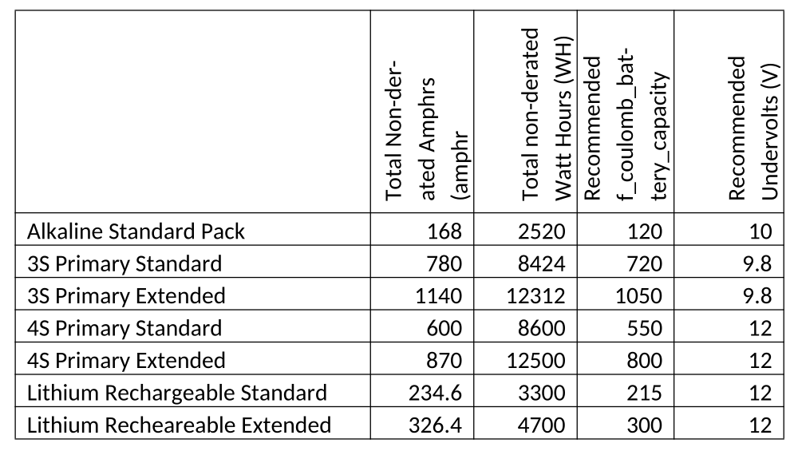

# Batteries

Documentation for Slocum glider battery packs — both rechargeable and primary
(non-rechargeable) configurations.

## In This Section

-   :material-battery-charging: **Rechargeable**

    ---

    TWR rechargeable lithium-ion smart batteries — charging and querying procedures.

    [:octicons-arrow-right-24: Rechargeable](rechargeable/index.md)

-   :material-battery: **Primary**

    ---

    Primary (non-rechargeable) battery packs.

    [:octicons-arrow-right-24: Primary](primary/index.md)

## Battery Pack Capacities

<figure markdown>
  
  <figcaption>
    Capacity and recommended settings by pack type — total non-derated Amp-hours
    and Watt-hours, recommended <code>f_coulomb_battery_capacity</code>, and
    recommended undervolts (V).
  </figcaption>
</figure>
