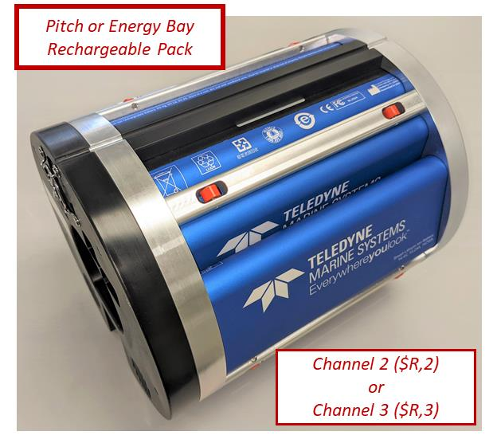
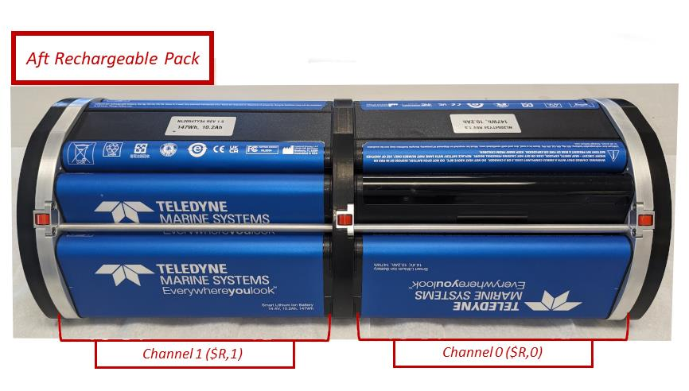
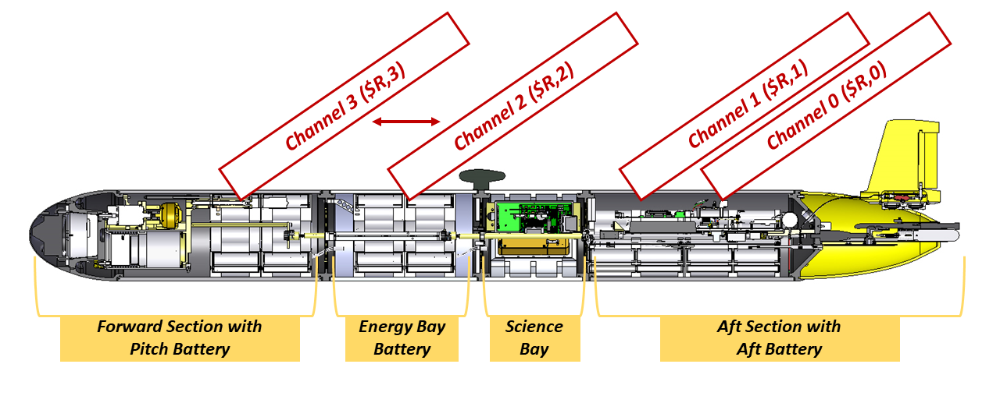
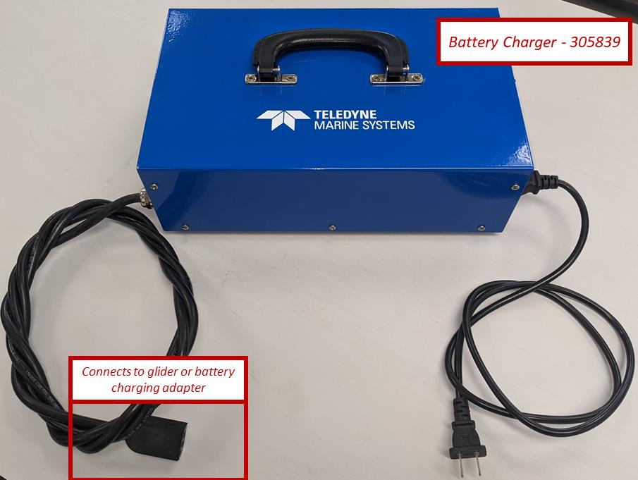
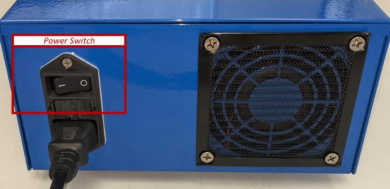
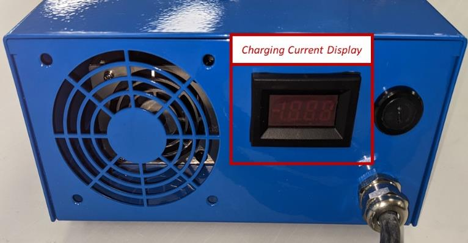
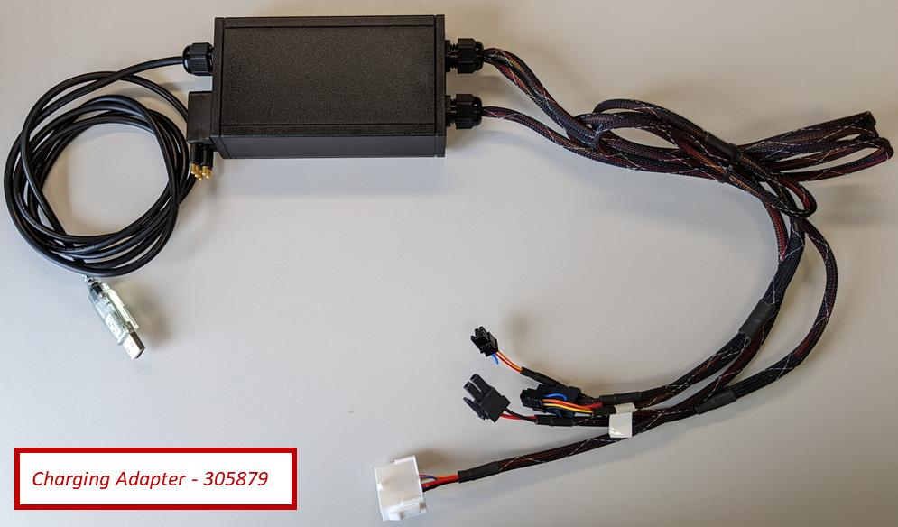
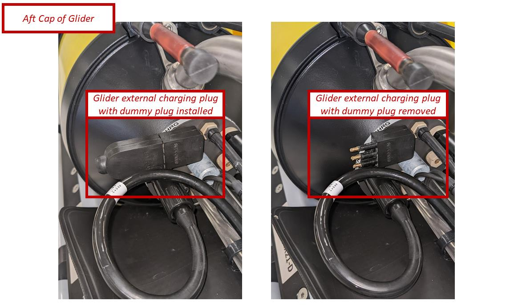
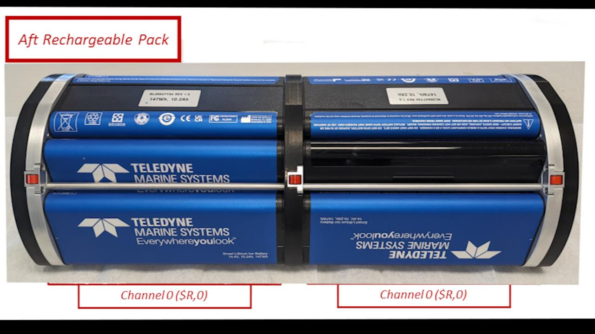

# Rechargeable Lithium-Ion Batteries

Procedures for **charging** and **querying** the Teledyne Webb Research (TWR)
rechargeable lithium-ion smart battery packs used in Slocum G3 gliders.

!!! info "Source"
    Organized from the TWR guide *"Rechargeable Lithium Ion Batteries:
    Procedures for Charging and Querying"* (Rev. 2022-09-06). This is a
    condensed reference — defer to the official Teledyne documentation for your
    specific glider.

---

## Hardware Overview

The rechargeable packs are **smart batteries**: each communicates over a set of
channels, addressed as `$R,0` through `$R,3`.

| Pack | Channel(s) | Location |
|---|---|---|
| Aft pack | `$R,0` (Channel 0) **and** `$R,1` (Channel 1) | Aft section |
| Pitch pack | `$R,2` (Channel 2) | Forward section |
| Extended energy bay pack | `$R,3` (Channel 3) | Energy bay (if installed) |

!!! note "Channel assignment is not always consistent"
    A pitch or extended energy-bay pack registers as **Channel 2 (`$R,2`)** or
    **Channel 3 (`$R,3`)** depending on the cable it is connected to. If no
    extended energy bay is installed, Channel 2 or Channel 3 will simply not
    respond.

<figure markdown>
  { width="48%" }
  { width="48%" }
  <figcaption>
    TWR rechargeable smart batteries. <strong>Left:</strong> a pitch or extended
    energy-bay pack (Channel 2 or 3). <strong>Right:</strong> the aft pack, split
    into two channels — Channel 0 (<code>$R,0</code>) and Channel 1
    (<code>$R,1</code>).
  </figcaption>
</figure>

<figure markdown>
  
  <figcaption>
    Battery locations along the glider: pitch battery (forward), extended energy
    bay battery, and aft battery. Channels 0 and 1 serve the aft pack; Channels 2
    and 3 serve the pitch / extended energy-bay packs.
  </figcaption>
</figure>

---

## Charging Equipment

| Item | TWR part number |
|---|---|
| Battery Charger ("Charging Box") | **305839** |
| Battery Charging Adapter | **305879** |
| Charging port jumper | LPIL-5 |

<figure markdown>
  { width="60%" }
  <figcaption>Charging box for TWR rechargeable smart batteries (P/N 305839). The output lead connects to the glider or to the charging adapter.</figcaption>
</figure>

<figure markdown>
  { width="48%" }
  { width="48%" }
  <figcaption>
    Side views of the charger (P/N 305839): <strong>left,</strong> the power
    (rocker) switch above the AC cord; <strong>right,</strong> the charging-current
    display.
  </figcaption>
</figure>

<figure markdown>
  { width="60%" }
  <figcaption>
    Charging adapter (P/N 305879) — used to charge and communicate with the packs
    when they are <em>not</em> installed in a G3 glider. It can charge one aft
    battery and two pitch batteries at once; the connections are keyed.
  </figcaption>
</figure>

---

## Charging Procedure — Batteries Installed in a G3 Glider

!!! warning "Powering on while charging"
    The glider may be powered on while charging, but use caution running
    simulations or bench tests — power-related data may not be reliable during
    charging.

<figure markdown>
  { width="80%" }
  <figcaption>
    Aft cap of a G3 glider with the tail cowling removed. <strong>Left:</strong>
    charging plug covered with its dummy plug (normal, not charging).
    <strong>Right:</strong> dummy plug removed to expose the charging plug.
  </figcaption>
</figure>

1. Remove the aft tail cowling.
2. Remove the **LPIL-5 dummy plug** from the charging port and set it aside.
3. Connect the battery charger (P/N 305839) to the charging port using the LPIL-5.
4. Plug the charger into a **110 V AC** outlet.
5. Turn the charger on with the rocker switch above the AC power cord.

The batteries will begin charging.

!!! tip "Reading the charge current"
    The charger display shows charge current, which varies as it establishes
    communication with the packs:

    - Initial draw of ~**1 A** rises to ~**12 A** (standard configuration) or
      ~**17 A** (extended configuration) within a minute or two, then stabilizes.
    - A nearly discharged battery draws slightly less than a full one.
    - Charging cables may feel **warm** to the touch — this is normal.
    - As each pack finishes, the current drops. When **all** packs are charged,
      the current settles around **0.5 A**.

---

## Charging Procedure — Batteries Removed from the Glider

!!! note "Requires the charging adapter"
    This method uses the Battery Charging Adapter (P/N 305879).

1. Remove the batteries from the glider. For pitch and energy-bay batteries,
   disconnect the pitch battery cable from the battery and leave the cable in the
   glider.
2. Connect the charging adapter to the battery. The adapter can charge **one aft
   battery and two pitch batteries** simultaneously — the connections are keyed.
3. Confirm the battery charger is **off**.
4. Connect the battery charger to the charging adapter.
5. Plug the charger into a **110 V AC** outlet.
6. Turn the charger on with the rocker switch above the AC power cord.

Charge-current behavior is the same as the installed procedure above (~1 A rising
to 12 A / 17 A, settling near 0.5 A when complete).

---

## Querying the Batteries — Installed, via SFMC

!!! danger "Lab use only"
    Put the glider into Shell **only in the lab over Freewave — never on a
    deployed glider.**

!!! note
    Batteries can be queried while charging.

1. Power on the glider and connect to it via Freewave on a mobile dockserver
   running SFMC.
2. Put the glider into **Shell**.
3. From **GliderShell**, type `talk battery` and press enter.
4. In SFMC, switch to the **serial perspective** terminal (different from the
   normal SFMC communication path):
    - Click the **Configuration** tab → **System Status**.
    - Under **Dock Server Ports**, find the green square for the USB port the
      glider is on, then click the terminal (`>_`) icon next to it to open the
      serial perspective.
5. Query the packs with the commands below, pressing enter after each.

!!! warning "Commands are case-sensitive"
    | Command | Pack |
    |---|---|
    | `$R,0` | Aft pack — Channel 0 (note: Batt #1 on `$R,0` is empty) |
    | `$R,1` | Aft pack — Channel 1 |
    | `$R,2` | Pitch pack — Channel 2 |
    | `$R,3` | Extended pack — Channel 3 |

    The aft pack has **two separate channels** — query each to get data from the
    full pack.

!!! tip
    Expect to run each command **several times** to collect data from all cells in
    a pack. More repetitions may be needed while the batteries are charging.

---

## Querying the Batteries — Direct Connection

!!! note "Requires the charging adapter"
    This method uses the Battery Charging Adapter (P/N 305879). Batteries can be
    queried while charging.

1. Remove the batteries from the glider.
2. Connect the charging adapter (305879) to your computer via **USB**.
3. Open a terminal emulator such as **TeraTerm** or **Procomm**.
4. Connect to the USB serial port with these settings:

    | Setting | Value |
    |---|---|
    | Baud rate | 115200 |
    | Data | 8 bit |
    | Parity | none |
    | Stop | 1 bit |
    | Flow control | none |

5. Query the packs with `$R,0` … `$R,3` (**case-sensitive**), as in the SFMC
   method. The channel a pitch/extended pack answers on (2 or 3) depends on the
   cable it is connected to.

!!! warning "The aft pack has one empty cell by design"
    `$R,0` **Batt #1** is an intentional dummy cell. When queried it always
    returns status `0x210` with no information — this is normal.

<figure markdown>
  { width="70%" }
  <figcaption>The aft rechargeable pack, showing the location of the empty "dummy" cell at <code>$R,0</code> Batt #1.</figcaption>
</figure>

---

## Reading the Query Output

A single cell of a pack returns a block like this:

```text
Batt #: 0
Status: 0xcc50
LTCO: 0x202
Voltage: 14551 mV
Current: 756 mA
Temperature: 298.101562 K
Serial: 1533
Remaining Capacity: 3685 mAh
Full Charge Capacity: 9876 mAh
Time to full charge: 508 min
Cycle Count: 4
Thermistor (raw): 32512
Thermistor (V): 2.480528
Manufacturer Name: INSPIREDE
Device Name: NL2054HD34
Device Chemistry: LION
```

### Decoding the Status word

`Status` is a 16-bit value reported in hexadecimal. To interpret it, convert the
four hex digits after `0x` to **16 binary bits** (e.g. with the Windows
Calculator in *Programmer* mode, or an online hex-to-binary converter).

Example: `0xcc50` → `1100 1100 0101 0000`. Reading the bits left to right as
positions 1–16, the bits that are **on** are **4, 6, 10, 11, 14, 15**.

!!! note "This is the charger IC status — not the cell's state of charge"
    These bits report the status of the **charging integrated circuit** for each
    battery, not the battery's charge level.

| Bit | Flag | Bit | Flag |
|---|---|---|---|
| 1 | AC_PRESENT | 9 | VOLTAGE_OR |
| 2 | BATTERY_PRESENT | 10 | CURRENT_OR |
| 3 | POWER_FAIL | 11 / 12 | LEVEL_3 / LEVEL_2 |
| 4 | ALARM_INHIBITED | 13 | CURRENT_NOTREG |
| 5 | RES_UR | 14 | VOLTAGE_NOTREG |
| 6 | RES_HOT | 15 | POLLING_ENABLED |
| 7 | RES_COLD | 16 | CHARGE_INHIBITED |
| 8 | RES_OR | | |

!!! info "SafetySignal resistance flags"
    - **RES_UR** — resistance under range: SafetySignal resistance < 575 Ω.
    - **RES_OR** — resistance over range: SafetySignal resistance > 95 kΩ.
    - **RES_HOT** — SafetySignal resistance < 3150 Ω (hot battery). Set whenever
      RES_UR is set.
    - **RES_COLD** — SafetySignal resistance > 28.5 kΩ (cold battery). Set
      whenever RES_OR is set.

---

## Battery Life, Warranty & Shelf Life

!!! info "Manufacturer specifications (Inspired Energy)"
    - **Life expectancy:** ~**6174 mAh** after **300 charge/discharge cycles**
      under normal storage and use (charge phase CC/CV 4000 mA, 16.8 ± 0.05 V;
      discharge 2040 mA down to 2.5 V/cell at 25 °C).
    - **Warranty:** one (1) year from date of shipment from Inspired Energy
      against defects in workmanship, material, and construction.
    - **Shelf life:** shipped at 20–30 % rated capacity, giving a minimum **6
      months** shelf life at 25 °C. Higher storage temperatures shorten this —
      recharge periodically.

!!! warning "Deep-discharge shutdown"
    To prevent parasitic drain, the electronics enter a shutdown mode if any cell
    voltage drops to **≤ 2300 mV**. Recovering from this requires an initial low
    (pre-charge) to reactivate the electronics before normal charging. Any SMBus
    v1.0+ compatible charger can supply this pre-charge.
