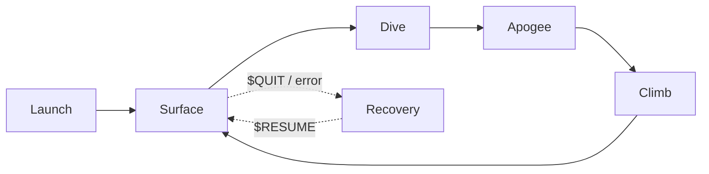

# Dive Cycle & Control Files

A Seaglider is piloted **indirectly**: the vehicle repeats a *canonical dive*
— surface, dive, apogee, climb, and back to the surface — entirely on its own,
and the pilot influences the *next* dive by leaving files on the basestation
for the glider to collect when it calls in. There is no live terminal: everything the pilot wants to change is expressed as
a handful of plain-text control files. Understanding the dive cycle and those
files is the foundation of Seaglider piloting — every other topic (trim,
flight model, sampling) builds on it.

!!! info "Source"
    Paraphrased from the APL-UW IOP *SGX Documentation* (v1.0, September 2024),
    the UW *Seaglider Pilot's Guide*, the IOP *Basestation3 and seaglider.pub
    Best Practices* note, and the IOP Seaglider webinar series
    ([iop.apl.washington.edu/iopsg](https://iop.apl.washington.edu/iopsg/)).
    Parameter behavior varies between firmware revisions — always confirm
    against the [Parameter Reference Manual](https://iop-apl-uw.github.io/basestation3/html/Parameter_Reference_Manual.html)
    for your firmware, and defer to the APL-UW IOP group's documentation.

---

## The control design in one paragraph

Seaglider flight control follows two guiding principles: **hold a constant
vertical velocity** and **spend as little energy as possible** doing it. The
glider samples its sensors evenly in time, so constant vertical speed gives
evenly spaced samples in depth. The pump that moves hydraulic oil to the
external bladder is roughly **half the energy budget** of the vehicle, so the
control scheme is built around avoiding unnecessary pump strokes: no bleeding
is allowed on the dive (excess speed is tolerated), and pumping on the climb is
allowed freely because that oil would have to be pumped at the surface anyway.

The desired vertical velocity is never set directly. It falls out of two
parameters:

```
w_desired = (2 × $D_TGT × 100 cm/m) / ($T_DIVE × 60 s/min)   [cm/s]
```

| Parameter | Meaning |
|-----------|---------|
| `$D_TGT` | Target depth of the dive (m) |
| `$T_DIVE` | Time for the full surface-to-surface dive (min), excluding apogee pumping |

!!! tip "The 3:1 rule of thumb"
    A typical desired vertical velocity is **10 cm/s**, which works out to
    `$D_TGT / $T_DIVE = 3` (metres per minute). First shallow test dives are
    commonly `$D_TGT,45` / `$T_DIVE,15`; a full-depth dive starts around
    `$D_TGT,990` / `$T_DIVE,330`.

For each dive the software picks a pitch angle and a buoyancy, bounded by
`$GLIDE_SLOPE` (steepest glide allowed), `$MAX_BUOY` (most negative buoyancy
allowed on the dive), the stall angle, and neutral buoyancy. Pitch is chosen
first, from the distance to the next waypoint — steep if the waypoint is far,
shallow if it is close — and buoyancy is then chosen to achieve the desired
vertical velocity in the densest water expected on the dive.

---

## The guidance & control (G&C) loop

During the profile phases the glider alternates between two modes:

- **Active G&C** — at intervals set in the `science` file, the glider wakes and
  performs up to three corrections, always in this order: **pitch, VBD, roll**.
  Only one actuator moves at a time.
- **Passive G&C** — between corrections the processor drops into a low-power
  sleep and the glider simply flies in the state left by the last active cycle.

Science data acquisition is **never interrupted** by G&C: the glider samples on
its own schedule through dive, apogee, and climb, whether or not the actuators
are moving.

---

## Run phases



### Surface

Everything the pilot ever changes takes effect here. The surface phase runs
through a fixed sequence:

1. **Surface maneuver** — pitch full forward, roll neutral, pump to `$SM_CC`
   (typically near maximum VBD) so the antenna mast clears the water. If the
   glider is still deeper than `$D_SURF`, it pumps to maximum *first* and
   re-checks — this is the escape path after a `$T_MISSION` timeout.
2. **GPS1** — first fix; the receiver runs until a position with HDOP < 2.0 is
   found or `$T_GPS` / `$N_GPS` limits are hit.
3. **Communications** — the glider calls the basestation over Iridium,
   uploads its data/log/capture files, and downloads any control files the
   pilot has staged. Failed sessions retry every `$CALL_WAIT` seconds up to
   `$CALL_TRIES` times; a completely failed surfacing increments `$N_NOCOMM`.
4. **Surface depth & pitch** — averages of 10 pressure and 10 pitch readings
   are logged as the surface reference for the next dive.
5. **GPS2** — the last position before diving.
6. **Navigation & flight calculations** — heading, pitch, and buoyancy for the
   next profile are computed (including the bathymetry-map lookup if enabled),
   and a new dive begins.

### Dive

The dive starts with a **bleed-only** first G&C cycle to get the glider moving
down while pitch is still full forward. At `$D_FLARE` it flares into normal
flight: regular G&C cycles trim pitch, VBD, and roll to the computed values.
If the glider runs *fast* on the dive (too heavy), no corrective pumping is
done — the excess speed is tolerated to save energy. One quirk worth
remembering: on the dive the Seaglider **turns to starboard by banking to
port**, the opposite of aircraft convention.

### Apogee

At `$D_TGT` (or an altimeter/bathymetry-triggered bottom), a two-cycle
maneuver swings the glider from diving to climbing without stalling: first
pitch to `$APOGEE_PITCH` with VBD pumped to 0 cc (neutral), then pitch and VBD
to the mirror image of the dive values. Sampling continues throughout.

### Climb

The glider rises at the same target vertical speed. Bleeding is never used to
correct a too-fast climb (that oil would just be pumped again at the surface);
pumping *is* used if the glider is slow, and `$MAX_BUOY` does not constrain
the climb. On the climb the glider banks to starboard to turn to starboard,
as in aircraft flight. At `$D_SURF` it goes passive, samples briefly while
coasting up (at most ~50 more data points), then enters the surface phase.

### Recovery

Recovery is the "park on the surface and phone home" state — entered by pilot
command (`$QUIT`) or automatically on an error condition. The glider loops:
GPS fix, call the basestation, sleep `$T_RSLEEP` minutes (plus ~2 min of
overhead), repeat. It leaves recovery only when the pilot places a `$RESUME`
directive in the cmdfile.

---

## The four control files

The pilot commands the Seaglider through four plain-text files in the mission
directory on the basestation. At every call-in the basestation uploads any that
have changed, then archives the sent version as `<name>.ddd.nnn` (dive number
`ddd`, call cycle `nnn`) — so the mission directory keeps a complete history of
every command ever sent.

| File | What it controls | Edit with |
|------|------------------|-----------|
| `cmdfile` | Parameter changes and the glider's state (dive / stay on surface) | `cmdedit` |
| `targets` | The waypoint list the navigation logic flies | `targedit` |
| `science` | G&C intervals and sensor sampling schedule by depth band | `sciedit` |
| `pdoscmds.bat` | Extended PicoDOS housekeeping commands (file management, uploads) | any text editor |

!!! tip "Always use the checking editors"
    On a basestation3 host, edit with `cmdedit`, `targedit`, and `sciedit`
    rather than a bare text editor — they run the same validation the
    basestation applies, and they keep a change history (`cmdedit.log`,
    `targedit.log`, `sciedit.log`). They respect the `EDITOR` environment
    variable if you prefer `nano` over `vi`.

### `cmdfile` — parameters and directives

Each line is either a parameter assignment or a directive:

```text
$D_TGT,45
$T_DIVE,15
$T_MISSION,25
$GO
```

The file **must end in exactly one directive**, which sets the glider's state:

| Directive | Meaning |
|-----------|---------|
| `$GO` | Carry on — keep flying the mission with the (possibly updated) parameters |
| `$QUIT` | Enter recovery: stay on the surface and call in every `$T_RSLEEP` minutes |
| `$RESUME` | Leave recovery and resume diving |

!!! warning "`$RESUME` is sticky — swap it out after it works"
    A cmdfile ending in `$RESUME` will push the glider out of recovery *every
    time it is uploaded*. The standard launch pattern shows the discipline:
    hold the glider on the surface with `$QUIT`, verify trim and surface
    behavior, send `$RESUME` with the first-dive parameters — and **as soon as
    the dive starts, put `$QUIT` (or `$GO`) back** so a later, unexpected
    surfacing doesn't blindly send the glider back down. Leaving stale
    directives in place is a classic new-pilot mistake.

### `targets` — where to fly

A line-oriented waypoint list; `/` in column 0 marks a comment. Each target
names its successor, so the file forms a route (a target may point back to
itself to station-keep):

```text
/ Shilshole targets (small rectangle)
SE lat=4743.0 lon=-12224.0 radius=100 goto=NE
NE lat=4743.5 lon=-12224.0 radius=100 goto=NW
NW lat=4743.5 lon=-12225.0 radius=100 goto=SW
SW lat=4743.0 lon=-12225.0 radius=100 goto=SE
```

!!! warning "Coordinates are DDMM, not decimal degrees"
    `lat=4743.5` means 47° 43.5′ N — **degrees and decimal minutes run
    together**, negative for south/west. The same convention Slocum users know
    from waypoint lists; a decimal-degrees value will be silently wrong.

Optional per-target fields:

| Field | Effect |
|-------|--------|
| `escape=` | Target to head for in a not-parked recovery scenario; chain escape targets to define a full bail-out route to a pickup point |
| `finish=` | A "finish line" bearing: the target counts as achieved once the glider crosses the line drawn through the target perpendicular to this heading (`-1` = off) |
| `depth=` | Achieve the target by crossing a bathymetric contour: positive = crossing deep→shallow, negative = shallow→deep |

The glider resumes its last active target from nonvolatile storage after a
reset; otherwise it starts at the first listed target. `$HEADING` overrides
the navigation logic entirely (fly a fixed course).

### `science` — sampling and G&C by depth band

Depth-binned, **tab-separated** lines (tabs, not spaces — a classic
hand-editing pitfall; `sciedit` gets it right):

```text
// depth  gc-interval  sampling  sensor-mask  compass  pressure
45	gc=60	seconds=5	sensors=11	compass=1	pressure=1
1000	gc=180	seconds=15	sensors=12	compass=1	pressure=1
```

Each line gives, for all depths down to `bottom_depth`: the G&C interval
(seconds), the base sensor sampling interval (seconds), a **sensor mask** (one
digit per installed sensor in `$SENSORS` order — `0` = off, `1` = every
interval, `2` = every 2nd, and so on), and compass/pressure intervals as
multipliers of the base interval. On gliders fitted with a **science
controller (scicon)**, sensor scheduling moves to `scicon.sch` and the
`science` file's sensor mask is ignored — it then mainly sets G&C intervals.

### `pdoscmds.bat` — housekeeping

A batch of Extended PicoDOS commands run at the end of a call-in: resending or
deleting files on the compact flash, uploading new bathymaps, and similar
maintenance. Powerful and unvalidated — see the
[Extended PicoDOS Reference Manual](https://iop-apl-uw.github.io/basestation3/html/epdos_Reference_Manual.html)
before using it.

---

## What else lives in the mission directory

Beyond the four control files, the basestation side of a mission involves:

| Category | Files | Notes |
|----------|-------|-------|
| Glider data | `.log`, `.dat`, `.cap` | Uploaded each call-in; the raw record of every dive |
| Basestation config | `sg_calib_constants.m`, `pagers.yml`, `sections.yml`, `missions.yml` | Calibration constants, alerting, plotting, and which missions vis displays |
| Processed output | `.eng`, `.asc`, `.nc` files and plots | Generated by basestation3 conversion after each call |
| Session logs | `comm.log`, `baselog_*` | Every interaction between glider and basestation — the first place to look when a call behaves oddly |

!!! danger "Don't change `mass` mid-mission"
    The Flight Model System bases all of its calculations on the vehicle mass
    in `sg_calib_constants.m` **as of dive 1**. Changing it later does not
    re-baseline FMS — it keeps using the original value, and inconsistent
    edits corrupt downstream CTD corrections. Get it right before launch.

### Basestation3 housekeeping best practices

- **Start every mission with `NewMission.py`** — it creates the mission
  directory, seeds `sg_calib_constants.m`, links `pagers.yml`, and points the
  glider's `current` symlink at it. Never `mkdir` mission directories by hand;
  wrong permissions break file conversion later.
- **Keep the pre-launch self-test in the mission directory.** The self-test
  review features of vis expect it there, and remote troubleshooters will ask
  for it first.
- **Never mix deck-dive data and real mission data** in one directory — move
  simulated dives out with `MoveData.py` (or start a fresh mission directory).
  Leftover simulated dives can stop the Flight Model System from running on
  the real mission.
- List every mission you want visible in `missions.yml` (active mission at the
  top; add `status: complete` when done), and test edits with
  `vis.py … -t` before installing them.

---

## Deck dives (simulated dives)

A deck dive exercises the entire end-to-end path — glider software,
Iridium, basestation conversion, plots — with simulated pressure:

1. Configure glider and basestation exactly as for a real mission.
2. Set `$SIM_W,0.1` (simulated 10 cm/s vertical speed) and launch with
   **Test Launch** instead of Sea Launch.
3. No sky view? Either set `$SIMULATE,3` to fake GPS and Iridium too, or stay
   on the serial console and set `$N_NO_SURFACE` to a large negative number so
   the glider skips the surface comms entirely.

!!! warning "Only pressure is simulated"
    All science instruments record **in-air** data during a deck dive. Legato
    CTD data will be flagged `QC_BAD` (so no corrected CTD or oxygen output),
    and in-air ADCP data produces no velocity products. Verify instruments are
    alive by checking the `.eng` / `.nc` files directly — a missing plot does
    not mean a dead sensor. And remember to set `$SIMULATE,0` before the real
    self-test and launch.

---

## Quick parameter reference

The parameters met on this page, in one table:

| Parameter | Role |
|-----------|------|
| `$D_TGT` / `$T_DIVE` | Dive depth (m) and duration (min) — together set vertical speed |
| `$T_MISSION` | Hard time limit on a dive; triggers the surface escape path |
| `$D_SURF` | Depth at which the climb hands over to the surface phase |
| `$D_FLARE` | Depth at which the initial dive plunge flares into trimmed flight |
| `$SM_CC` | VBD volume pumped for the surface maneuver (antenna out of water) |
| `$APOGEE_PITCH` | Intermediate pitch during the dive→climb transition |
| `$MAX_BUOY` | Most negative buoyancy allowed on the dive |
| `$GLIDE_SLOPE` | Steepest glide slope allowed |
| `$T_GPS` / `$N_GPS` | GPS acquisition timeout and sample budget |
| `$CALL_WAIT` / `$CALL_TRIES` / `$N_NOCOMM` | Comms retry behavior and failed-call counter |
| `$T_RSLEEP` | Minutes between calls while in recovery |
| `$HEADING` | Fixed-course override of waypoint navigation |
| `$SIM_W` / `$SIMULATE` / `$N_NO_SURFACE` | Deck-dive simulation controls |

For the complete list, see the
[Parameter Reference Manual](https://iop-apl-uw.github.io/basestation3/html/Parameter_Reference_Manual.html).

---

## See also

- [Trim & Flight Model](trim-and-flight-model.md) — choosing `$C_VBD`,
  pitch/roll trim, and how the basestation's Flight Model System tunes flight
  coefficients.
- [Mission Files (Slocum)](../slocum/mission-files.md) — the equivalent page
  for the Slocum platform, for pilots flying both.
