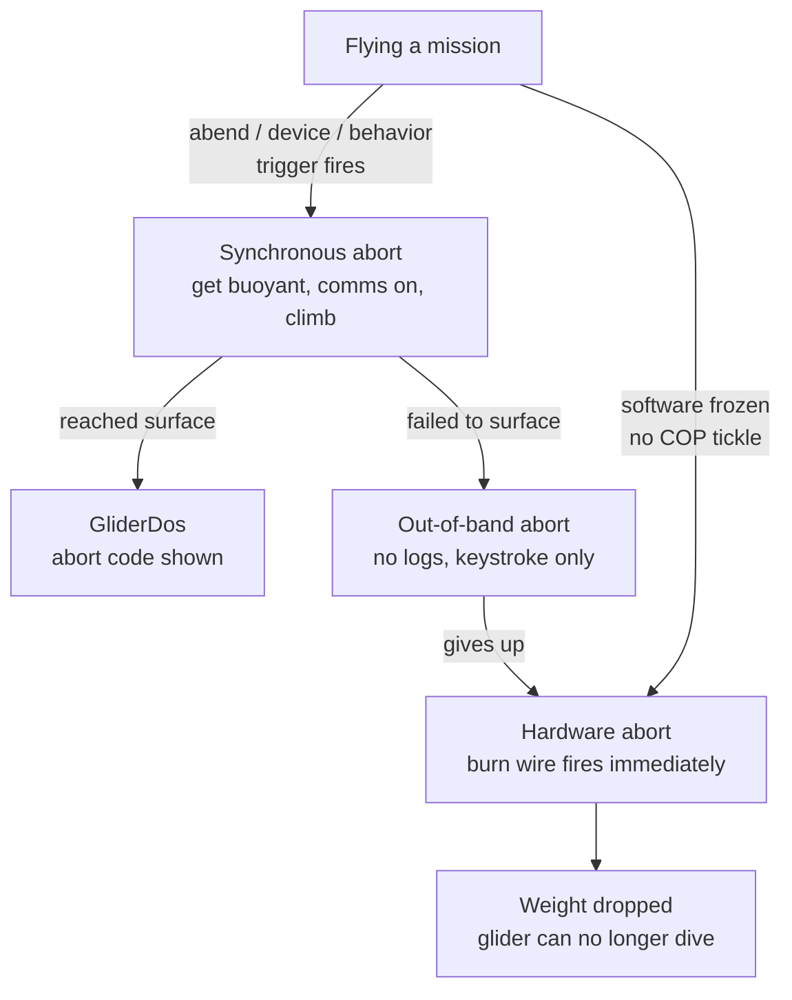
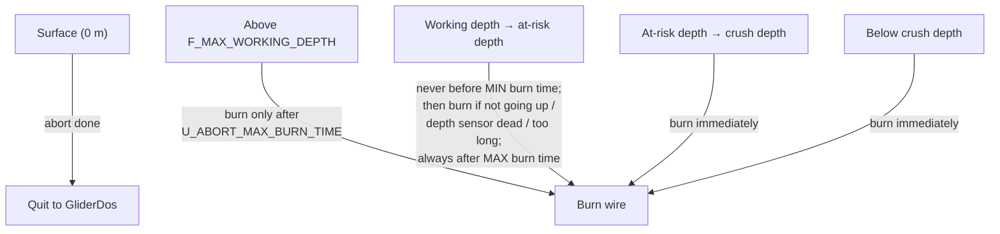

# Aborts

An **abort** is the Slocum's self-preservation reflex: when something goes wrong,
the glider stops flying its mission, makes itself positively buoyant, turns on
everything that can be used to locate it, and comes to the surface so a pilot can
take over. Understanding *why* a glider aborted — and how patient it will be
before it does something irreversible like dropping its weight — is one of the
core skills of piloting a Slocum.

This page is a field reference for reading and responding to aborts. It is **not**
a substitute for getting your hands on the actual abort/`.mlg` log and, for a
glider at sea, contacting **glidersupport@teledyne.com** — TWR explicitly asks
that operational aborts be handled through support, not the user forum.

!!! info "Source"
    Paraphrased from the Webb Research *abort sequences* engineering write-up
    (`doco/abort-sequuences.txt` / *Slocum abort behaviours*), the *Slocum G3
    Glider Operators Manual*, the `masterdata` `abend` behavior block, the
    Teledyne Webb Research user forum (the **Aborts** board in particular), and
    the UG2 community Slack. Behavior arguments, sensor names, and defaults move
    between firmware releases — **always confirm against the `masterdata` and
    `command.h` shipped with your firmware**, and simulate mission changes in the
    lab before flying them.

---

## The three kinds of abort

There are three abort mechanisms, in increasing order of "the software is in
trouble":

| Type | Who runs it | Log files? | How it ends |
|------|-------------|-----------|-------------|
| **Synchronous** | Flight software, using most of the normal flight code | Yes — `LOG`, `MLG`, `DBD`, `SBD` stay active | At the surface → returns to GliderDos with an abort code |
| **Out of band (OOB)** | A stripped-down path that assumes the flight code itself is unreliable | **No** — no log files are produced | Only a user keystroke (`Ctrl-C` → reset) |
| **Hardware generated** | A hardware watchdog circuit, independent of software | No | Drops the weight immediately and powers the recovery devices |

The first two are software; the third is pure hardware. They escalate: a
synchronous abort that concludes it *failed* to reach the surface triggers an
out-of-band abort, and an out-of-band abort (or a frozen CPU) eventually lets the
hardware watchdog fire.



---

## The drop weight and the burn wire

Every Slocum carries a one-time **jettison (drop) weight** held by a **burn
wire**. Running current through the wire corrodes it until it parts and the
weight falls away, making the glider strongly positive. It is the last-ditch way
to the surface.

!!! danger "Dropping the weight ends the deployment"
    Once the weight is gone the glider **cannot dive again** until it is
    recovered and a new weight is installed. The software abort sequences are
    therefore written to be *patient* — they exhaust other options and burn the
    wire only when the glider is at risk of being crushed or is clearly not
    coming up. The **hardware** abort, by contrast, burns the wire immediately.

Burn time depends on the water:

- **Salt water:** about **2 minutes**.
- **Fresh water:** about **6 hours** (much higher resistance) — relevant for
  freshwater lake work and for tank tests.

The firmware uses `F_TIME_TO_BURN_WIRE` as its a-priori estimate of how long the
burn will take when it decides whether there is time to burn before reaching
crush depth.

The weight-drop state is **sticky**. The sensor `m_weight_drop` latches to `1`
once a drop is commanded and stays there across resets, so a glider that dropped
its weight and then reset in the field will refuse to run a mission rather than
dive without a weight. See [`(33)MS_ABORT_WEIGHT_DROPPED`](#weight-dropped-33)
below — this also bites during lab checkout if you forget to zero it.

!!! note "The emergency circuit"
    A separate **emergency battery** and circuit can power the **air pump**,
    **Argos PTT**, and the **burn wire** independently of the flight computer.
    The glider does **not** monitor that battery's voltage, so assume it is
    partially depleted after any deployment and replace it with the main packs.
    See [Argos](../../glider-components/slocum/argos/index.md) and
    [Primary Batteries](../../glider-components/slocum/batteries/primary/index.md).

---

## Reading an abort

### The GliderDos prompt

After a synchronous abort the prompt itself tells you what happened:

```
GliderDos A 8 >
```

- The **letter** is the mission-end status:
    - `I` — **Initial**: no mission has run since reset.
    - `N` — **Normal**: the last mission ended normally.
    - `A` — **Abnormally**: the last mission ended in a synchronous abort.
- The **number** is the abort code (`X_MISSION_STATUS`). In the example, `8` =
  `MS_ABORT_OVERTIME`. The numbers are defined in `command.h`; the table
  [below](#abort-codes) lists them.

### The ABORT HISTORY block

In the surface dialog the glider prints a running abort history, e.g.:

```
ABORT HISTORY: total since reset: 4
ABORT HISTORY: last abort cause: MS_ABORT_BEH_ERROR
ABORT HISTORY: last abort details: layered_control(): The surface behavior entered B_ERROR state.
ABORT HISTORY: last abort time: 2014-07-28T21:17:38
ABORT HISTORY: last abort segment: <glider>-2014-205-0-55
ABORT HISTORY: last abort mission: MICRO.MI
```

The **details** line is the most useful field — it is the human-readable reason
behind a generic code. There is **no surface-dialog command to clear the abort
history**; only an `exit reset` (a full reboot) zeroes it. (Pilots have asked TWR
for a non-rebooting clear; as of this writing it does not exist.)

### Decoding the `abort_the_mission` printout

During a synchronous abort each cycle ("try") prints a block like:

```
62.87 28 behavior ?_-1: abort_the_mission(1): (8)MS_ABORT_OVERTIME
          depths ini: 6 working: 25 at risk: 186 crush: 200
          expected time/tries to surface: 457 30
          max time/tries to go up:  300 20
          too long: 0, not going up: 0, depth sensor busted: 0
          abort burn time/tries min: 600 40
          abort burn time/tries max: 3600 240
          ABOVE WORKING DEPTH
          drop_the_weight = 0
```

| Field | Meaning |
|-------|---------|
| `abort_the_mission(1)` | The abort **try (cycle) count** — here, the 1st cycle |
| `(8)MS_ABORT_OVERTIME` | Why the abort started (code + name) |
| `depths ini / working / at risk / crush` | Depth at abort start, `F_MAX_WORKING_DEPTH`, the at-risk depth, `F_CRUSH_DEPTH` (m) |
| `expected time/tries to surface` | Allowed climb time (s) and number of 15-s cycles |
| `too long / not going up / depth sensor busted` | Booleans for the three "burn the wire" tests |
| `abort burn time/tries min / max` | `U_ABORT_MIN_BURN_TIME` and `U_ABORT_MAX_BURN_TIME` (s and cycles) |
| `ABOVE WORKING DEPTH` | Which depth region the glider is in (see [below](#the-synchronous-abort-and-the-burn-wire-decision)) |
| `drop_the_weight` | Whether the sequence has decided to burn the wire |

The cycle time during an abort is forced to **15 seconds**, and the raw GPS
string is echoed every cycle to aid relocation.

!!! tip "After any abort, get the data"
    The synchronous abort leaves the normal log files intact. Pull the `.dbd` /
    `.mlg` from the abort segment and plot the relevant sensor (`m_depth`,
    `m_battery`, the leak voltages, `m_vacuum`, the pump oil volume…) **before**
    deciding whether the trigger was real. Many "scary" aborts turn out to be a
    single bad reading.

---

## Abort codes {#abort-codes}

These are the `MS_ABORT_*` codes that appear after the `A` in the GliderDos
prompt and in `X_MISSION_STATUS`. The negative/zero values are normal states, not
aborts. The exact numbering is firmware-specific — **check `command.h`** — but
the low numbers have been stable for years. Codes above ~19 were added in later
releases.

| # | Code | Plain meaning |
|---|------|---------------|
| −3 | `MS_NONE` | No mission has run |
| −2 | `MS_COMPLETED_ABNORMALLY` | Mission ended in an abort |
| −1 | `MS_COMPLETED_NORMALLY` | Mission finished cleanly |
| 0 | `MS_IN_PROGRESS` | Mission running |
| 1 | `MS_ABORT_STACK_IS_IDLE` | No behavior is commanding a required motor |
| 2 | `MS_ABORT_HEADING_IS_IDLE` | Nothing is steering (fin/roll) |
| 3 | `MS_ABORT_PITCH_IS_IDLE` | Nothing is commanding the pitch battery |
| 4 | `MS_ABORT_BPUMP_IS_IDLE` | Nothing is commanding the buoyancy pump |
| 5 | `MS_ABORT_THRENG_IS_IDLE` | Nothing is commanding the thermal engine |
| 6 | `MS_ABORT_BEH_ERROR` | A behavior entered its error state (very often the science "stop logging" timeout) |
| 7 | `MS_ABORT_OVERDEPTH` | Deeper than `abend overdepth(m)` |
| 8 | `MS_ABORT_OVERTIME` | Mission ran longer than `abend overtime(sec)` |
| 9 | `MS_ABORT_UNDERVOLTS` | `m_battery` below `abend undervolts(volts)` |
| 10 | `MS_ABORT_SAMEDEPTH_FOR` | Stuck at one depth too long |
| 11 | `MS_ABORT_USER_INTERRUPT` | A pilot typed `Ctrl-C` |
| 12 | `MS_ABORT_NOINPUT` | A required input (e.g. `m_depth`) stopped updating |
| 13 | `MS_ABORT_INFLECTION` | The inflection state machine did not finish in time (~52 s) |
| 14 | `MS_ABORT_NO_TICKLE` | Hardware watchdog not tickled within `no_cop_tickle_for` |
| 15 | `MS_ABORT_ENG_PRESSURE` | Thermal only — accumulator pressure too low for depth |
| 16 | `MS_ABORT_DEVICE_ERROR` | A device driver errored out of service (the most common, most varied code) |
| 17 | `MS_ABORT_DEV_NOT_INSTALLED` | A device needed to fly is not installed |
| 18 | `MS_ABORT_WPT_TOOFAR` | `m_dist_to_wpt` exceeded `max_wpt_distance` |
| 19 | `MS_ABORT_UNREASONABLE_SETTINGS` | A sanity check on settings failed |
| 20 | `MS_ABORT_LMC_NOT_FIXED` | Local-mission-coordinate / position fix problem |
| 21 | `MS_ABORT_NO_HEAP` | Free heap fell below `reqd_free_heap` / `reqd_spare_heap` |
| 22 | `MS_ABORT_LOG_DATA_ERROR` | Could not log data |
| 23 | `MS_ABORT_THERMAL_NOT_ENABLED` | Thermal engine needed but not enabled |
| 24 | `MS_ABORT_LEAK` | `m_leak` is non-zero (a leak detector tripped) |
| 25 | `MS_ABORT_VACUUM` | `m_vacuum` outside `vacuum_min … vacuum_max` |
| 26 | `MS_ABORT_NO_HEADING_MEASUREMENT` | No compass heading |
| 27 | `MS_ABORT_STALLED` | Not making vertical progress |
| 28 | `MS_ABORT_DE_PUMP_IS_IDLE` | Nothing commanded the deep electric pump |
| 29 | `MS_ABORT_DE_PUMP_NOT_ENABLED` | Deep pump needed but not enabled |
| 30 | `MS_ABORT_CPU_LOADED` | Cycle time overran too many times in a row |
| 31 | `MS_ABORT_NO_ABEND_BEHAVIOR` | No `abend` behavior in the mission |
| 32 | `MS_ABORT_LOW_REL_CHARGE` | Remaining charge below `remaining_charge_min(%)` (the lithium energy gauge) |
| 33 | `MS_ABORT_WEIGHT_DROPPED` | `m_weight_drop` is latched at 1 |
| 34 | `MS_ABORT_INITIALIZATION_ERROR` | Mission failed to load / a device failed to come back into service |

Later firmware adds more — e.g. `MS_ABORT_NO_COMMS_TICKLE` (no comms for
`no_comms_tickle_for` hours → reset and dial the factory Iridium number),
`MS_ABORT_CHARGE_MIN`, and the ice-handling family `MS_ABORT_SURFACE_BLOCKED` /
`MS_ABORT_NO_TICKLE_ICE` (see [Under-ice handling](#under-ice-handling)).

!!! tip "Codes 1–5, 17, 31 are almost always a mission-file bug"
    The "idle" and "not installed / no abend" aborts mean a motor or behavior was
    left uncommanded — typically a waypoint list that ran off the end with no
    `surface` to catch it, or an **empty mission file** (a truncated upload). Fix
    the mission and re-run; the glider is in no danger.

---

## The `abend` behavior — your abort settings

Most synchronous aborts are generated by the **`abend`** behavior, placed at the
top (highest priority) of the behavior stack in the mission file. Its `b_arg`
limits decide which conditions are watched and how strict they are. A value of
`-1` (or `<0`) disables a check. These are the knobs you tune when an abort is
firing too eagerly — but **loosen them only with a real reason and a lab test**.

| `b_arg` | Default | Triggers | Notes |
|---------|---------|----------|-------|
| `overdepth(m)` | 10000 | `OVERDEPTH` | Clipped to `F_MAX_WORKING_DEPTH` |
| `overtime(sec)` | −1 (off) | `OVERTIME` | Many fleets cap a segment/mission length here |
| `undervolts(volts)` | 10.0 | `UNDERVOLTS` | Triggered by `m_battery`. Leave at 10 for alkaline |
| `samedepth_for(sec)` | 1800 | `SAMEDEPTH` | Stuck-at-depth detector |
| `samedepth_for_sample_time(sec)` | 30 | — | Older missions used 10–15 s; raise toward 30 |
| `stalled_for(sec)` | 1800 | `STALLED` | No vertical progress |
| `no_cop_tickle_for(sec)` | 48600 | `NO_TICKLE` | Keep **below** the hardware timeout (2 h / 16 h) |
| `no_cop_tickle_percent(%)` | −1 | `NO_TICKLE` | Rev E+ boards: abort this % *before* the hardware would |
| `no_comms_tickle_for(hours)` | 72 | `NO_COMMS_TICKLE` | No comms for 3 days → reset + dial factory number |
| `max_wpt_distance(m)` | −1 (off) | `WPT_TOOFAR` | Geofence against a bad fix or bad mission |
| `reqd_free_heap` / `reqd_spare_heap (bytes)` | 50000 | `NO_HEAP` | Keep `lastgasp.mi`'s value **lower** than this |
| `leakdetect_sample_time(sec)` | 60 | `LEAK` | `<0` disables the leak check |
| `vacuum_min` / `vacuum_max (inHg)` | 4 / 12 | `VACUUM` | Out-of-band internal vacuum |
| `max_allowable_busy_cpu_cycles` | 75 | `CPU_LOADED` | ~5 min of overruns at a 4 s cycle |
| `remaining_charge_min(%)` | 10.0 | `LOW_REL_CHARGE` | The lithium "fuel gauge" abort |
| `invalid_gps(nodim)` | 10 | `INVALID_GPS` | Consecutive surfacings with no valid fix |

!!! warning "Every mission needs an `abend`"
    If a mission has no `abend` behavior the glider aborts with
    `MS_ABORT_NO_ABEND_BEHAVIOR`. Build your missions on the stock template so
    the safety behavior is always present, and keep `lastgasp.mi`'s `abend`
    limits looser than your main mission's so a lastgasp does not itself abort
    (this is why `reqd_*_heap` in `lastgasp.mi` must be lower).

---

## The synchronous abort and the burn-wire decision

Once a synchronous abort starts, the glider stops calling its behaviors and runs
a hardwired recovery loop: pump out to maximum buoyancy, pitch up, fin straight,
turn off unused input sensors to save power, and turn **on** GPS (echoing raw
text), Argos, and the Freewave console. It emits 20 pings at the start. Then each
cycle it decides, from `m_depth`, whether to keep waiting, drop the weight, or
give up to an out-of-band abort.

The ocean is divided into four regions by depth:



The **at-risk depth** is the depth from which the glider would reach crush depth,
while diving, in the time it takes to burn the wire and have the weight actually
drop:

```
at_risk_depth = F_CRUSH_DEPTH − nominal_dive_rate × F_TIME_TO_BURN_WIRE
              = 200 m − 0.12 m/s × 120 s ≈ 186 m   (example values)
```

!!! warning "The middle zone burns on `U_ABORT_MIN_BURN_TIME`, not `MAX` — patience is shorter than the old doc says"
    The legacy `abort-sequuences.txt` describes the working-depth-to-at-risk zone
    as protected until `U_ABORT_MAX_BURN_TIME` (default **14400 s ≈ 4 h**). The
    **code actually drops the weight as soon as `U_ABORT_MIN_BURN_TIME` (default
    600 s = 10 min) has elapsed *and* "not going up" / "depth sensor dead" /
    "too long" is true** — and it will also drop after `MAX` even if nothing is
    wrong. One operator lost a deployment this way when a **remora dragged the
    glider** just past `F_MAX_WORKING_DEPTH` (31 m vs a 30 m setting): "not going
    up" went true and the wire burned ~10 minutes later, not 4 hours. If you fly
    in waters where snagging or hitchhiker fish are likely, you can buy patience
    by **raising `U_ABORT_MIN_BURN_TIME`**, raising `U_ABORT_MAX_BURN_TIME`, and
    setting `F_MAX_WORKING_DEPTH` with margin — but never at the expense of crush
    safety.

In an **out-of-band** abort the logic is similar but coded independently (to
avoid sharing bugs), each "try" is much longer, no logs are written, and the
sequence escalates to dropping the weight by try count (≈21 tries) or immediately
below crush depth. It ends only on a keystroke: `Ctrl-C`, then answer the prompt
to **reset the system** (the normal choice — behaves like a fresh power-up into
GliderDos). Exiting to PicoDOS leaves the motors uncontrolled and should be
avoided in the water.

---

## Device errors, warnings, and oddities

`MS_ABORT_DEVICE_ERROR` (16) is the most common and most varied abort, so it is
worth knowing the device-health model behind it. Each device driver can report
four severities:

| Severity | Effect |
|----------|--------|
| **Oddity** | Logged and counted; **never** causes an abort or removes the device |
| **Warning** | Logged and counted; enough warnings become an error |
| **Error** | Device **taken out of service** and a synchronous abort triggered |
| **Permanent error** | Out of service until the next hardware reset (currently only an overheated buoyancy pump) |

**Warnings turn into an error** when they exceed the per-device limit — typically
**5 warnings/minute** or **20 warnings/segment**. (Oddities never escalate.) The
`use` command shows the limits and statistics:

```
use                    ; list all devices, limits, and error stats
use + <dev> ... <dev>  ; put device(s) back in service
use - <dev> ... <dev>  ; take device(s) out of service
use all | none
```

In the `use` table a name in **ALLCAPS** is a **critical** device (needed to
surface or to be located); an asterisk (e.g. `IRIDIUM*`) marks a **supercritical**
device (needed to talk to the glider). Critical devices are **not** taken out of
service for a device error during a mission; supercritical devices are never
taken out. The three trailing bracketed triples are errors / warnings / oddities,
each as `total / mission / segment`.

Related GliderDos commands:

- **`setdevlimit <dev> <os> <w/s> <w/m>`** — set how many times a device may be
  put back in service (`os`), and the warnings-per-segment / per-minute limits.
  `-1` disables a limit (e.g. `setdevlimit argos -1 100 4`). A device whose
  "times back in service" is `-1` can never turn a warning into an error.
- **`setnumwarn [N]`** — warnings allowed in GliderDos (not in a mission) before
  a device is dropped; default 2. Ignored for supercritical devices.
- **`clrdeverrs`** — zero all error/warning/oddity statistics.
- The `installed` and `use` statements in a mission file set these permanently
  (`use <dev> 0|1 [os w/s w/m]`).

Out-of-service devices are retried at the end of every mission and on every abort
cycle, so a transient glitch often clears on the next surfacing or `exit reset`.

!!! danger "The long-mission oddity flood (a known firmware bug)"
    On missions running continuously past **~50 days**, gliders (commonly G3/G3S
    on the 10.0x–11.0 line) can suddenly jump from a handful of oddities per
    surfacing to **hundreds of thousands or millions**, often ending in
    `MS_ABORT_BEH_ERROR`. The screen scrolls so fast you cannot get a command in.
    TWR has acknowledged this as a bug tied to long-duration missions. **Workaround:
    stop and restart the mission every ~6 weeks.** To regain control when it
    happens, send a few `Ctrl-C`s and then an `exit reset` blind (you may never
    see the prompt), or use a dockserver `.xml` script — scripts push characters
    through far more reliably than a human can.

---

## The hardware watchdog (COP), deadman, and ice

Independent of all the software logic, a hardware **watchdog** circuit will drop
the weight if the software stops "tickling" it (issuing a *Computer Operating
Properly*, COP, pulse). The timeout is set by a jumper:

- **JP22** → 2 hours; **JP21** → 16 hours (install **only one**).
- **JP20** → defeat the hardware timeout entirely.

When a jumper is changed, the `abend no_cop_tickle_for` argument must be set
**less** than the hardware time so the *software* aborts first and surfaces
without dropping the weight. The software tickles the watchdog when a pilot runs
a GliderDos command, when the Freewave or Iridium console is in contact, or (if
`u_tickle_on_gps`) when the GPS sees a satellite — i.e. whenever it has reason to
believe it is at the surface or talking to a human. The driver prints
`!!HARDWARE IN EMERGENCY MODE!!` if the hardware abort has fired, and warns if
the defeat jumper is installed.

The related **deadman** driver watches the CPU and resets it after **seven
minutes** of no activity (a frozen processor); the **watchdog** driver watches
the hardware abort timer and initiates the weight drop if it expires.

### Under-ice handling

With `u_expect_ice_near_surface` enabled, the glider replaces several aborts with
ice-aware behavior so it does not waste the weight when blocked by ice:

- Getting stuck trying to surface for `samedepth_for_surfacing` seconds raises
  `MS_ABORT_SURFACE_BLOCKED` and marks `x_under_ice = 1` instead of climbing into
  the ice.
- `u_always_cop_tickle` keeps the hardware watchdog tickled so it will not drop
  the weight under ice.
- `u_retry_no_tickle_ice` re-runs the last mission after an ice abort, and the
  `u_drop_time_ms_abort_*` family controls which abort classes are *allowed* to
  consume drop-weight time.

---

## Field guide: the aborts you actually see

A practical, abbreviated triage. For anything ambiguous, pull the log and contact
glidersupport.

### Device error (16)

Some device errored out of service. Run `use` to find which one (and check the
`.mlg` for the underlying `DRIVER_ERROR`). Frequently the **science bay**
(`science_super`) — a bad sensor string floods warnings until it drops. If the
device is non-critical you can sometimes drop the offending sensor from sampling
and `use - super_science` to keep flying without science. **Buoyancy-pump**
device errors (e.g. `!Buoyancy Pump is FAULTED!`, "Error reading position") are
serious — a failed position pot or board, sometimes alongside a forward leak,
that often cannot be recovered at sea. One field trick that has worked: set
`f_ballast_pumped_safety_max` to the value the pump is stuck near, which can let
you `use +` it back and limp toward recovery.

### Behavior error (6) — "timed out waiting for science to stop logging"

By far the most-reported `BEH_ERROR`. Since firmware 7.14 the glider aborts if
the science Persistor cannot cleanly open/close its log segment
(`Error from prepare_to_start_next_logging_segment()`), which also shows up as
empty `.tbd`/`.sbd` files and failed file transfers. Contributing factors pilots
have found: very **large `.sbd`/`.tbd` lists** that drop the connection
mid-transfer (trim them), flaky sensors (optode/CTD throwing bad strings), and
the long-mission oddity bug above. It is intermittent — "two in a day, then none
for a week." Because **sequenced** missions just roll into the next mission, many
operators accept the occasional abort rather than risk losing data; an
`exit reset` often quiets it for a while.

### Noinput (12)

No fresh `m_depth` arrived within the check window. Sometimes the flight pressure
transducer really is failing — verify with `report ++ m_depth` to see if readings
appear at a steady rate. More often the **CPU is too busy at inflection** to
accept good depth data. Mitigations: raise `samedepth_for_sample_time` toward
**30 s** (old missions at 10–15 s are too tight for newer code), and/or **fly by
CTD** with `u_use_ctd_depth_for_flying 1` if the flight transducer is suspect.

### Undervolts (9) and low relative charge (32)

`UNDERVOLTS` fires on `m_battery` (averaged) below `undervolts(volts)` — keep the
default **10 V** for alkaline; the under-load voltage while pumping at depth is
where it sags first. `LOW_REL_CHARGE` fires on the coulomb-counter fuel gauge
below `remaining_charge_min(%)` (default 10 %) and is the right trigger for
**lithium primary**, where voltage is a poor capacity indicator. Either way,
treat it as **"recover soon"**. Don't bump `undervolts` up out of nerves — that
just burns energy aborting; instead trend `m_battery` / `m_coulomb_amphr_total`
through the deployment so you can predict end-of-life. If pickup is far off,
switch to surface drift and extreme power saving rather than diving on a dying
pack. See [Power Saving](power-saving.md) and
[Primary Batteries](../../glider-components/slocum/batteries/primary/index.md).

### Leak (24)

`m_leak` non-zero — a leak detector (forward, science, aft, or the digifin)
tripped. **First, plot the leak-detect voltage from the log**: a real leak shows
a sustained drop that does not dry out, while a **single-sample glitch back to
2.5 V** is usually electrical, not water. False **digifin** leaks in particular
are a known Iridium-line-noise artifact — see
[Fin / Digifin → leak detect](../../glider-components/slocum/digifin/index.md).
A **forward** leak, a leak that won't dry, or a leak **with a falling vacuum** is
real: experienced pilots **drop the weight** rather than risk the glider going
down, especially when recovery is days away. If you keep it drifting instead, see
[Keeping an aborting glider safe](#keeping-an-aborting-glider-safe-on-the-surface).

### Vacuum (25)

Internal vacuum left the `vacuum_min … vacuum_max` band. A slow steady **drop**
is a developing leak path; a sudden change at launch can be a seal not fully
pulled down. Cross-check against the leak detectors and the pump — a vacuum drop
*with* a leak voltage drop is water intrusion.

### Weight dropped (33) {#weight-dropped-33}

`m_weight_drop` is latched at `1`. In the field this means the weight is gone and
the glider correctly refuses to dive. In the **lab**, it usually means a checkout
that pre-dates the `m_weight_drop` sensor left it set — after testing the
release, set both `c_weight_drop 0` and `m_weight_drop 0` or every power cycle
will look like a weight drop.

### No heap (21)

Free heap fell below `reqd_*_heap` — a slow memory creep on long missions
(reported on 8.3+). Pilots have safely lowered `reqd_spare_heap` from 50000 to
~30000 as a band-aid, **provided `lastgasp.mi`'s value stays lower still**. A
firmware update is the real fix.

### Initialization error (34)

The mission failed to load (missing file, syntax error such as an uncommented
line), or a device could not be put back in service at start. It frequently
travels with the science "stop logging" problem. A truncated mission upload
(empty file) is a classic cause — re-send the mission. A corrupt CF card cannot
be safely reformatted at sea; keep flying with sampling removed and
`use - super_science`.

### CPU loaded (30)

The cycle time overran 4 s (by more than `u_allowable_cycle_overrun`, default
~1 s) for more cycles in a row than `max_allowable_busy_cpu_cycles`. Usually a
mission heavier than stock, seen most in **simulation**. Newer firmware trims
overhead; otherwise raise/disable the test on the shoebox only, never untested on
a real glider.

---

## Keeping an aborting glider safe on the surface

When a glider has aborted for something it can't fix (a leak, a dead pump, a low
battery) and recovery is hours or days away, the goal is to **hold it on the
surface, conserve energy, and keep getting positions** — without it diving or
burning the weight on a repeating abort.

- **Decide on the weight.** If you believe the leak/fault is real and the glider
  is at risk of sinking, **drop the weight** — it is cheap insurance and the
  community's consistent advice for a confirmed forward leak or failing vacuum.
  If you keep diving capability, you accept some risk for the chance to finish or
  reposition.
- **Stop it diving.** A bare `nofly.mi` can itself abort with
  `MS_ABORT_BPUMP_IS_IDLE` (no behavior commands the pump) — pilots keep a
  modified **`noflyt.mi`** for leaking gliders, or simply stay in **GliderDos**
  with the ballast pump disabled.
- **Stretch the surface time.** Raise `u_max_time_in_gliderdos` and the Iridium
  callback time, and run a repeating callback script (e.g. `callback 10` /
  `... - where ...`) at a cadence matched to your battery and pickup window
  (typically 1–6 h). The forum's "extreme energy conservation while waiting for
  recovery" post is the canonical recipe.
- **Mind `lastgasp`.** If you cannot maintain comms (no sat phone offshore), a
  safe `lastgasp.mi` that holds position and reports may be your only lifeline —
  make sure it is one you trust and that its `abend` limits won't make it abort.

Full power-saving detail (surface and at-depth drift, GliderDos recipe, lastgasp
caveats) lives on the [Power Saving](power-saving.md) page.

---

## Good habits

- [ ] **Always `sequence` missions, never `run` a single one unattended.** After
      an abort, a `run` mission leaves the glider sitting on the surface with no
      active control; a `sequence` rolls into the next mission (and finally into
      `lastgasp.mi`).
- [ ] Build every mission with an **`abend`** behavior, on the stock template.
- [ ] Keep `lastgasp.mi`'s abort limits **looser** than the main mission's.
- [ ] After any abort, **plot the triggering sensor from the log** before
      believing the trigger.
- [ ] Trend `m_battery` and `m_coulomb_amphr_total` so undervolts / low-charge
      aborts never surprise you.
- [ ] On missions over ~6 weeks, **plan a stop/restart** to dodge the oddity
      flood.
- [ ] Keep ready-to-go **dockserver `.xml` scripts** for hammering `Ctrl-C` /
      `exit reset` into a glider that won't respond.
- [ ] For a glider at sea, take operational aborts to
      **glidersupport@teledyne.com**, not the forum.

---

## See also

- [Slocum Piloting Checklist](checklists/slocum-piloting-checklist.md) — the
  daily log that catches drifting values before they become aborts.
- [Power Saving](power-saving.md) — surface drift and energy conservation while
  waiting for recovery.
- [Fin / Digifin](../../glider-components/slocum/digifin/index.md) — false
  digifin leak aborts from line noise.
- [Primary Batteries](../../glider-components/slocum/batteries/primary/index.md)
  and [Argos](../../glider-components/slocum/argos/index.md) — emergency-circuit
  devices and lithium energy behavior.
