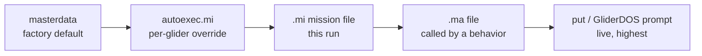

# Mission Files

A Slocum mission is a **plain-text file** that tells the glider what to do:
where to fly, how deep to yo, which sensors to sample, when to come up for
comms, and — most importantly — every condition under which it should stop what
it is doing and get itself safely back to the surface. Writing and editing these
files is the day-to-day craft of piloting a Slocum.

This page explains how a mission file is put together, walks through each of the
standard behaviors, and shows how the same file encodes both the *work* the
glider does and the *safety net* that keeps it alive. For the flip side — how to
read and respond once the glider has actually aborted — see the
[Aborts](aborts.md) page.

!!! info "Source"
    Paraphrased from the *Slocum G3 Glider Operators Manual* (Section 9 —
    Missions and Appendix B — Code Theory and Operation / Sample Mission), the
    Teledyne Webb Research basic glider-training material, the `masterdata`
    reference, the TWR user forum (the **Missions** board in particular), and the
    UG2 community Slack. Behavior arguments, sensor names, and defaults change
    between firmware releases — **always confirm against the `masterdata` shipped
    with your firmware** and simulate any mission change in the lab before flying
    it. This is an operator's overview, not a replacement for TWR documentation
    or the SFMC (Slocum Fleet Mission Control) User Manual, which covers the
    mission-planning interface itself.

---

## `.mi` and `.ma` files

Two file types make up a mission, and both live on the glider's flash card:

| Extension | Name | What it holds | Run on its own? |
|-----------|------|---------------|-----------------|
| `.mi` | **Mission file** | The main file — the ordered list of behaviors and any sensor values for the run | **Yes** — this is what you `run` or `sequence` |
| `.ma` | **Mission acquisition file** | The *details* pulled out of a behavior: a waypoint list, a surfacing recipe, a yo envelope, a sampling pattern | **No** — always called *from* a `.mi` file |

The split exists so a mission can be written **generically** and the
deployment-specific parts swapped in. A `goto_list` behavior in the `.mi` says
"my waypoints come from file number 10"; the actual latitudes and longitudes
live in `goto_l10.ma`. To retask the glider to a new area you edit one small
`.ma` file and leave the mission logic untouched.

!!! note "The `.ma` numbering convention"
    A behavior references its `.ma` file by a number in the
    `args_from_file(enum)` argument, and the filename is built from the behavior
    plus that number:

    | Behavior | `args_from_file` | File it reads |
    |----------|------------------|---------------|
    | `goto_list` | `10` | `goto_l10.ma` |
    | `surface` | `10` | `surfac10.ma` |
    | `yo` | `14` | `yo14.ma` |
    | `sample` | `10` | `sample10.ma` |

    The number is just a handle — you can keep several numbered variants on the
    card (`surfac10.ma`, `surfac21.ma`, `surfac26.ma`) and point different
    surface behaviors at different ones.

### `autoexec.mi` — the one that is *not* a mission

`autoexec.mi` lives in the glider's `config/` directory and is a special `.mi`
file that runs at every power-up. It carries everything that is **unique to that
individual glider**: the list of installed hardware, motor and sensor
calibrations, the vehicle name, the Iridium phone number(s), and per-vehicle
overrides such as `F_MAX_WORKING_DEPTH`. It is **not interchangeable** between
gliders — do not copy one glider's `autoexec.mi` onto another. See the
[component pages](../../glider-components/slocum/index.md) for the device-list and
calibration entries that live here.

---

## Where a value comes from: the masterdata hierarchy

The glider tracks roughly **2,500 variables** during a mission, called
**sensors** (`sensor:`). Every sensor, behavior, and behavior-argument has a
factory default defined in a single large file called **`masterdata`**, which is
compiled into the code and edited only by TWR when they cut a new release.

When a mission runs, a value can be set in several places. Later sources
**override** earlier ones:



So a `put` typed at the GliderDOS prompt beats an `.ma` value, which beats the
`.mi`, which beats `autoexec.mi`, which beats `masterdata`. This is why you can
nudge a live glider from the prompt without editing files — and why a value
"mysteriously" not taking effect is almost always being overridden further down
the chain.

!!! tip "Comments and syntax"
    - Any line beginning with `#` is a **comment** and is ignored. Any other line
      is acted on.
    - A sensor is set with `sensor: name(units)   value`; a behavior argument
      with `b_arg: name(units)   value`.
    - **Commenting out a `b_arg` reverts it to its `masterdata`/default value** —
      it does not "leave it alone." If you comment out a whole behavior's
      arguments, the behavior falls back to defaults, which may not be what you
      want.

---

## The layered-behavior model

Slocum flight code uses a **layered, single-thread** design: each task is a
**behavior** (`behavior:`), built from **behavior arguments** (`b_arg:`). The
key idea for writing missions:

> **Order is priority.** The glider is only ever doing one thing at a time. When
> a mission loads, GliderDOS reads it top-to-bottom and assigns each behavior a
> priority by its **position in the file** — earliest = highest. If two
> behaviors both want control, the higher one wins.

That is why every mission starts with `abend` (the reasons to give up and abort)
and `surface` (the reasons to come up), and only *then* lists the flying work
(`goto_list`, `yo`) and sampling. The mission reads, in effect, as a ranked list
of "the most important thing for the glider to be doing right now."

Each behavior sits in one of four states at any moment — **uninitiated**,
**waiting for activation**, **active**, or **complete** — and only **one
behavior is active at a time**. The two arguments that move a behavior between
states are `start_when` and `stop_when`, whose numeric codes are listed toward
the end of `masterdata`.

A typical mission's priority stack looks like:

```
1 – abend          (safety: reasons to abort)
2 – surface        (reasons to come up for comms / GPS)
3 – set_heading    (steer, if used directly)
4 – yo             (dive/climb through the water column)
5 – prepare_to_dive(settle and get a GPS fix before diving)
6 – sensors_in     (turn the input sensors on)
```

---

## Anatomy of a mission — behavior by behavior

The rest of this section walks the standard behaviors in roughly the order they
appear in a real mission (based on TWR's published `gy10v001.mi` sample and the
stock `astock.mi`).

### `abend` — the safety net

`abend` (**ab**ort/**end**) is almost always the **first** behavior, and it is
the heart of the glider's self-preservation. Its `b_arg`s define the conditions
under which the glider abandons its mission and aborts to the surface:

```
behavior: abend
  b_arg: overdepth(m)                 1000.0   # abort if deeper than this
                                               #   (clipped to F_MAX_WORKING_DEPTH)
  b_arg: overdepth_sample_time(s)     10.0     # how often to check
  b_arg: overtime(s)                  -1.0     # abort if mission runs longer than this
                                               #   (<0 disables)
  b_arg: samedepth_for(s)             120.0    # abort if depth stops changing this long
  b_arg: samedepth_for_sample_time(s) 30.0     # how often to check
  b_arg: no_cop_tickle_for(s)         7000.0   # abort if the watchdog isn't tickled
                                               #   this often (<0 disables)
```

These are a handful of the `abend` arguments; the full set (undervolts, leak
detect, vacuum, remaining charge, stalled, no-comms tickle, and more) and the
complete `MS_ABORT_*` code list are covered on the **[Aborts](aborts.md)** page.
The practical point when *writing* a mission:

!!! danger "Set the abend limits for the water you are in"
    `overdepth` is clipped to the glider's `F_MAX_WORKING_DEPTH` (set in
    `autoexec.mi`), but you should still set the mission's `abend` limits to
    match the deployment: an `overdepth` a little below the local bottom, an
    `overtime` sized to the real dive duration, and `samedepth_for` long enough
    that a legitimate slow inflection doesn't trip it but short enough to catch a
    glider stuck on the bottom. These are the values that turn "the glider is
    misbehaving" into "the glider aborted and called home" instead of a lost
    vehicle.

### `surface` — the reasons to come up

A mission usually contains **several** `surface` behaviors, each covering a
different reason to come up. Because order is priority, they are ranked: mission
done, no-comms, hit-a-waypoint, science-requested, every-so-often, and so on.
Each one is essentially a `start_when` (the trigger) plus a `surfac##.ma` recipe
for *how* to climb and what to do at the top.

A `surfac10.ma` recipe looks like:

```
behavior_name=surface
<start:b_arg>
    b_arg: c_use_bpump(enum)   2        # ballast pump full out (positive buoyancy)
    b_arg: c_bpump_value(X)    1000.0
    b_arg: c_use_pitch(enum)   3        # 3 = servo (rad); >0 = climb
    b_arg: c_pitch_value(X)    0.3491   # 20 deg nose-up
<end:b_arg>
b_arg: start_when(enum)        12       # BAW_NOCOMM_SECS
b_arg: when_secs(sec)          1200     # 20 min without comms
b_arg: end_action(enum)        1        # 1 = wait for ^C (quit/resume)
b_arg: report_all(bool)        1        # T = report all sensors once at surface
b_arg: gps_wait_time(sec)      120      # how long to wait for a GPS fix
b_arg: keystroke_wait_time(sec)300      # how long to hold for a control-C
```

The `start_when(enum)` value is the reason the glider surfaces. The ones you use
most:

| `start_when` | Reason the glider surfaces |
|:------------:|----------------------------|
| `0` | Immediately |
| `1` | Stack idle (mission is done — nothing left controlling the glider) |
| `2` | Pitch/depth idle (e.g. a yo finished, or a bad altimeter hit ended dive+climb in one cycle) |
| `3` | Heading idle (no more waypoints to fly to) |
| `6` | Every `when_secs` seconds since last surfacing |
| `7` | Within `when_wpt_dist` metres of the waypoint |
| `8` | When it **hits** a waypoint |
| `9` | Every `when_secs` (periodic timer) |
| `11` | `BAW_SCI_SURFACE` — a science sensor requested surfacing |
| `12` | `BAW_NOCOMM_SECS` — no communications for `when_secs` seconds |

**`end_action`** decides what happens once it is up: `0` quit, `1` wait for the
pilot's `Ctrl-C` (quit or resume), `2` resume automatically, `3` drift until far
enough from the waypoint.

!!! tip "No-comms time vs. every-x-minutes time — a classic mix-up"
    Two surface behaviors both use `when_secs` but mean different things.
    `start_when 12` (no-comms) surfaces only if the glider has gone that long
    **without hearing from a pilot**; `start_when 9` (or `6`) surfaces on a plain
    **timer** regardless of comms. A common setup: push the **no-comms** timer
    *out* well past how long a normal dive-to-waypoint should take (e.g. 7 h if
    waypoints are ~5 km apart at ~1 km/h), and let the **every-x-minutes** timer
    (default ~3 h) be the routine call-home. For a deep glider you often
    **disable most surface reasons** and keep only "surfaced after N yos," so the
    glider isn't wasting a deep pump climbing up a kilometre short of a waypoint.

The six surface reasons in the stock mission, in priority order, are a good
mental template: **mission done → no-comms → hit a waypoint → science requested
→ every-x-minutes → (bad-yo safety)**.

### `goto_list` — waypoints

`goto_list` tells the glider where to fly. Like the others it usually reads a
`.ma`:

```
behavior: goto_list
  b_arg: args_from_file(enum)   10     # read goto_l10.ma
  b_arg: start_when(enum)       0      # immediately
```

```
behavior_name=goto_list
<start:b_arg>
    b_arg: num_legs_to_run(nodim)  -1   # -1 = loop the list forever
    b_arg: start_when(enum)        0    # BAW_IMMEDIATELY
    b_arg: list_stop_when(enum)    7    # advance when within when_wpt_dist
    b_arg: initial_wpt(enum)       -2   # -2 = start at the closest waypoint
b_arg: num_waypoints(nodim)        6
<end:b_arg>
<start:waypoints>
-7040.271 4138.861
-7040.271 4138.807
-7040.333 4138.780
-7040.395 4138.807
-7040.395 4138.861
-7040.333 4138.888
<end:waypoints>
```

!!! warning "Waypoint format: longitude first, decimal-minutes"
    Waypoints are **`longitude latitude`** on each line, in
    **degrees-and-decimal-minutes** (`DDDMM.mmm`), *not* decimal degrees.
    `-7040.271` is 70° 40.271′ **West**; `4138.861` is 41° 38.861′ **North**.
    Getting this format wrong is one of the easiest ways to send a glider
    somewhere very unexpected — the stock mission famously flies toward Webb's
    home pond in Massachusetts if you run it unedited. Useful settings:
    `num_legs_to_run -1` loops the list forever; `initial_wpt -2` starts at the
    nearest waypoint (handy so the glider doesn't backtrack on deployment).

### `yo` — diving and climbing

A `yo` is one dive-and-climb through the water column; the behavior repeats it.
Its `.ma` carries a nested `dive_to` and `climb_to`:

```
behavior_name=yo
<start:b_arg>
b_arg: start_when(enum)          2      # pitch idle
b_arg: num_half_cycles_to_do(nodim) -1  # -1 = yo forever
    # dive_to
    b_arg: d_target_depth(m)     20
    b_arg: d_target_altitude(m)  3      # inflect this far off the bottom (-1 = ignore)
    b_arg: d_use_pitch(enum)     3      # servo
    b_arg: d_pitch_value(X)      -0.3491# -20 deg (dive)
    # climb_to
    b_arg: c_target_depth(m)     3.5
    b_arg: c_target_altitude(m)  -1
    b_arg: c_use_pitch(enum)     3
    b_arg: c_pitch_value(X)      0.3491 # +20 deg (climb)
    b_arg: end_action(enum)      2      # resume
<end:b_arg>
```

The yo envelope is the **depth band** the glider flies: `d_target_depth` /
`d_target_altitude` set the bottom of the dive (whichever it reaches first —
depth or height off the bottom via the [altimeter](../../glider-components/slocum/altimeter/index.md)),
and `c_target_depth` sets how shallow it climbs before the next dive. Pitch is
usually **servo** (mode `3`); modes `1` (battpos) and `2` (set-once) trade
accuracy for power and quiet — see the
[Pitch Vernier](../../glider-components/slocum/pitch/index.md) and
[Power Saving](power-saving.md) pages. How much buoyancy the pump uses per yo is
where [Autoballast](autoballast.md) comes in.

### `set_heading` — steering directly

Normally `goto_list` does the steering, but `set_heading` lets a mission command
a fixed heading (or drive the fin directly) — useful for flying an eddy, holding
into a current, or a survey line. It is possible to build a mission that
**toggles between `goto_list` and `set_heading`** via their `.ma` files (for
example, follow waypoints most of the time but switch to a held heading over a
feature), though it takes care to get the priorities and start/stop conditions
right.

### `prepare_to_dive` — settle and get a fix

```
behavior: prepare_to_dive
  b_arg: start_when(enum)  1     # stack idle
  b_arg: wait_time(s)      720   # wait up to 12 min for a GPS fix before diving
```

This is what makes the glider sit at the surface after launch (or after a
surfacing) until it has a good GPS fix, then begin the dive.

### `sensors_in` and `sample` — the science

`behavior: sensors_in` turns on most of the **input sensors**. Actual science
sampling is controlled by `sample` behaviors, which by default are bundled: with
`c_science_all_on_enabled` set to `1`, a single `sample##.ma` (e.g.
`sample10.ma`, "all sensors on the downcast") drives the whole science bay. Set
`c_science_all_on_enabled 0` and you can write an individual `sample` behavior
per instrument — one sensor on upcast only, another only in the top 50 m, and so
on. Power-saving and PAM missions lean heavily on this; see
[Power Saving](power-saving.md) and
[Passive Acoustic Monitoring](passive-acoustic-monitoring.md).

!!! warning "Watch the sampling `.ma` tags and the `nth_yo` counter"
    A few sampling gotchas that bite in the field:

    - When splitting the science bay into per-sensor `sample` files, get the
      `<start:b_arg>` / `<end:b_arg>` tags right — a commented-out end tag or
      mismatched start/end across multiple files silently breaks the parse.
    - To sample less often, `sample10.ma` has an `nth_yo_to_sample` counter
      (e.g. sample every *other* yo to save power). Test the exact value in the
      lab — an off-by-one here means you log nothing, or everything.
    - To run a sensor only every few hours you generally combine
      `c_science_all_on_enabled 0` with a timed `sample` behavior; ask on the
      forum/Slack for a worked example if you have not done it before.

---

## Running, sequencing, and simulating a mission

Before flying anything, TWR's checklist is worth following literally:

1. Connect the [Freewave](../../glider-components/slocum/freewave/index.md) radio
   to its antenna and a laptop; be ready to open a terminal in SFMC.
2. Power the glider with the **go (green) plug**.
3. **Confirm the glider is not in Simulation Mode** — `simul.sim` and
   `appcmd.dat` must be **deleted** from the `config/` directory, or the glider
   will happily "fly" a sim on the bench and *not* in the water.
4. Run **`status.mi`** and check: everything initializes, there is a GPS fix,
   batteries are healthy, and no errors scroll by.

Then load the mission from the GliderDOS prompt:

| Command | Effect |
|---------|--------|
| `run mission.mi` | Run one mission once |
| `sequence a.mi b.mi c.mi` | Run several missions back-to-back |
| `sequence mission.mi(n)` | Run one mission `n` times |
| `loadmission sci_on.mi` | Common helper to bring the science bay up |

At startup the glider typically **sequences `initial.mi` then the main
mission** — `initial.mi` runs once (a short shakedown) and the deployment
mission runs "forever." Keep known-good copies of `initial.mi` and
`lastgasp.mi`: they have been found **corrupted** on flash cards, and a corrupt
`initial.mi` can stop a glider from starting a mission at all.

!!! tip "Simulate every change before it flies"
    The single most valuable habit in mission editing: **run the mission in
    simulation in the lab** after any edit, and read the printout to confirm the
    behaviors activate in the order and at the thresholds you expect. When
    simulating autoballast or buoyancy, run the sim at full buoyancy (`±1000`) —
    see [Autoballast](autoballast.md). Small syntax slips (a mistyped `b_arg`, a
    stray non-comment line, a waypoint in decimal degrees) are cheap to catch on
    the bench and very expensive to discover at sea.

---

## How a mission encodes "all the reasons the glider comes up"

Pulling it together, a Slocum mission is a **ranked safety document** as much as
a flight plan. Reading top-to-bottom, a well-formed mission answers, in priority
order:

1. **When should I give up and abort?** → the `abend` behavior (overdepth,
   overtime, samedepth, undervolts, no-tickle, leak, vacuum, …). These are the
   irreversible-trouble triggers, detailed on **[Aborts](aborts.md)**.
2. **When should I come up for comms/GPS even though I'm fine?** → the `surface`
   behaviors and their `start_when` reasons (mission done, no-comms, hit a
   waypoint, science requested, every-x-minutes).
3. **Where and how should I fly?** → `goto_list`, `set_heading`, `yo`.
4. **What should I measure?** → `sensors_in`, `sample`.

If none of the higher-priority conditions is met, the glider keeps flying and
sampling. The moment one is — a low battery, a stuck depth, a comms gap, a
finished waypoint — the higher behavior takes control and the glider surfaces or
aborts. That layering is the "safety in place": you are not just telling the
glider what to do, you are telling it, in order, every circumstance under which
it should stop and phone home.

!!! danger "A missing or wrong reason to surface is a lost glider"
    The failure modes that lose gliders are usually *omissions*: an `abend`
    `overdepth` left at the pond default in deep water, a no-comms timer disabled
    or set implausibly long, all surface reasons removed on a deep mission with
    nothing left to bring it up. When editing a mission, always ask **"if this
    dive goes wrong, what brings the glider back?"** — and make sure at least one
    behavior still answers it.

---

## See also

- **[Aborts](aborts.md)** — reading and responding once the glider *has* aborted:
  the abort-code list, the `abend` arguments in full, the drop weight, and a
  field guide.
- **[Autoballast](autoballast.md)** — how much buoyancy drive the yo uses.
- **[Power Saving](power-saving.md)** — mission-level levers for energy: science
  subsampling, low-power flight, and surface behavior.
- **[Passive Acoustic Monitoring](passive-acoustic-monitoring.md)** — quiet
  mission design and per-sensor sampling.
- **[Pitch Vernier](../../glider-components/slocum/pitch/index.md)** and
  **[Altimeter](../../glider-components/slocum/altimeter/index.md)** — the yo
  pitch modes and bottom-avoidance that a mission drives.
