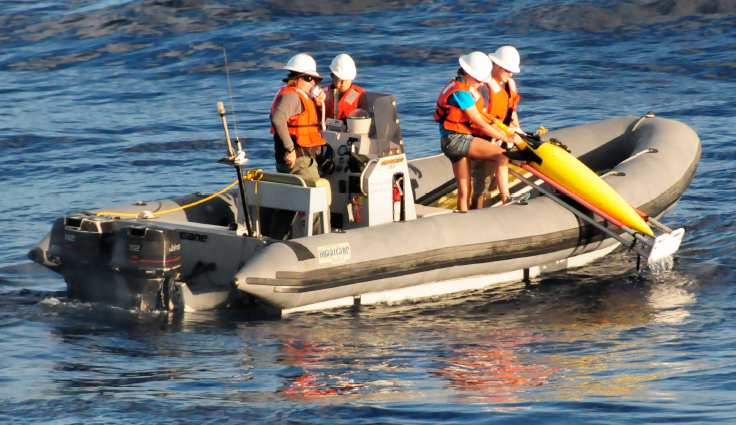
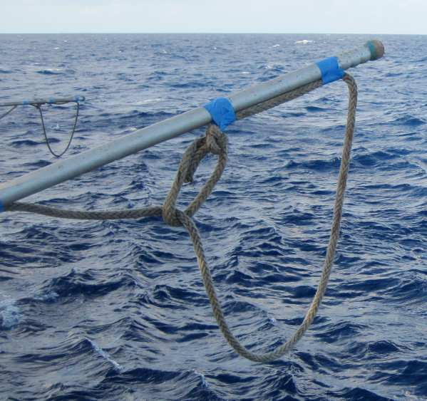
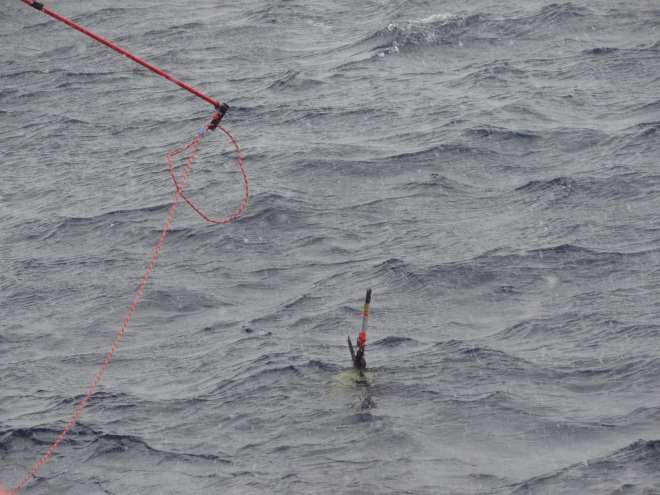
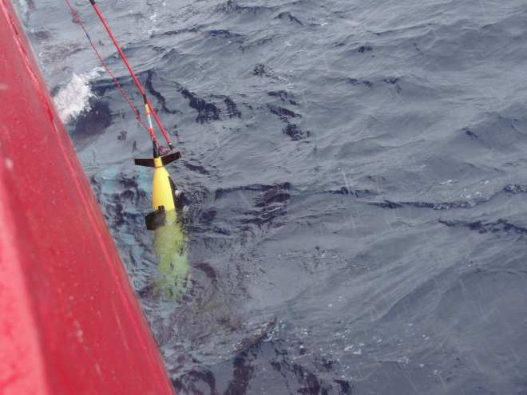
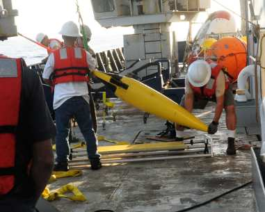

# Seaglider Recovery Procedure

!!! info "For field teams and vessel operators"
    This document covers the two Seaglider recovery methods: a small boat
    using a cradle, and a large vessel using a rudder lift. It complements the
    [Seaglider Recovery Checklist](checklists/seaglider-recovery-checklist.md),
    which covers the surrounding pilot/field-team timing and post-recovery
    steps.

!!! info "Source"
    Paraphrased from a community Seaglider recovery write-up,
    including photos from that recovery.

!!! danger "The only lift point on a Seaglider is the rudder"
    It has two notches designed for a loop of line. Never lift the glider by
    the antenna mast, sensors, or anything else — the antenna mast is for
    control and guidance only, not for taking the glider's weight.

In both methods, the pilot gives the recovery command in time for the
glider to already be waiting at the surface when the boat arrives, and the
boat approaches with the current pushing it **away** from the glider, never
onto it.

---

## Small Boat (Cradle)

1. Position the boat alongside the glider, current pushing away from it.
2. Take control of the glider by grabbing the antenna mast.
3. With the glider under control, a second person dunks the cradle
   vertically next to the boat.
4. Position the glider on top of the cradle, CT sail facing away from the
   boat, rudder hooked over the outside of the cradle's handle.
5. Keeping a grip on the glider, pull the cradle out of the water until
   water starts draining from the nose, and hold that position until it's
   fully drained.
6. Bring the cradle aboard and secure it in a safe position.

---

## Large Vessel (Rudder Lift)

1. Position the vessel alongside the glider, current pushing away from it.
2. Tape a large loop of line to the end of a long pole.

    

3. With the glider alongside the ship, work the loop over the antenna and
   around the underside of the rudder — the rudder notches are the only lift
   point.

    

4. Feed the line through a winch and lift the glider clear of the water,
   pausing to let it drain before bringing it aboard.

    

---

## Once Aboard

Move the glider to a secure area of the deck — a cart or cradle, not left
where it can roll — before doing anything else.

See the [Seaglider Recovery Checklist](checklists/seaglider-recovery-checklist.md#3-once-aboard)
for inspection, power-down, and post-recovery steps.
