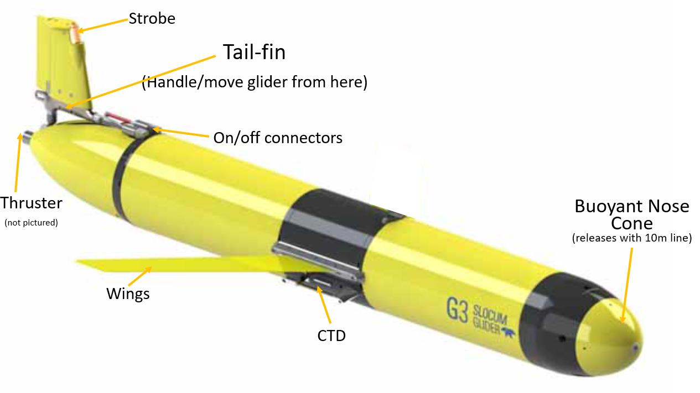
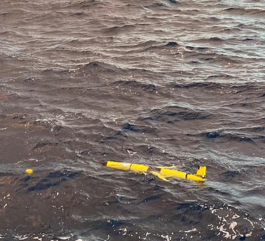
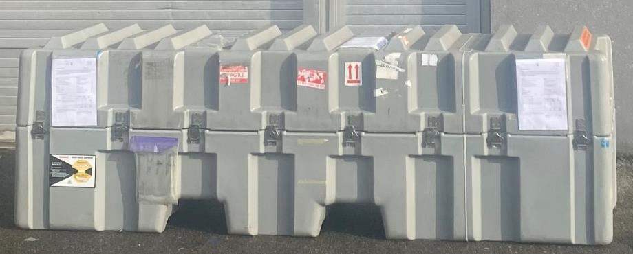
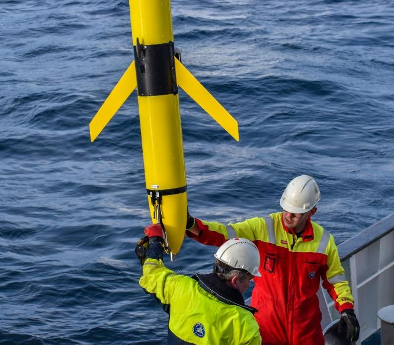
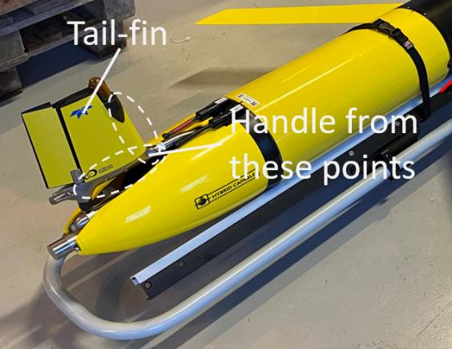
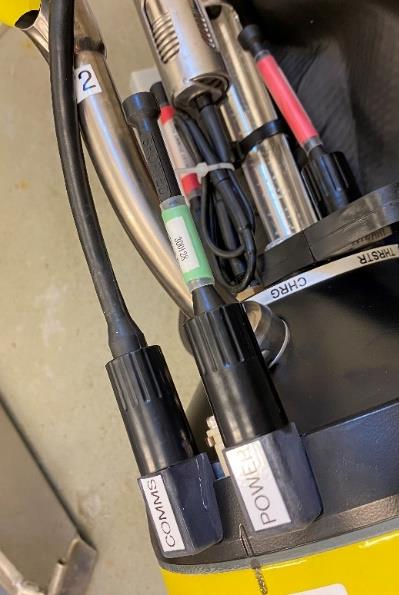

# Slocum Glider Field Recovery Procedure

!!! info "For vessel operators and external deployment partners"
    This document covers the field-team side of a Slocum G3 recovery: the
    nose recovery system (recommended), a backup workboat procedure if it
    fails to eject, and stowing the glider once it's aboard. For the
    corresponding on-shore actions, see
    [Remote Pilot Recovery Procedure](remote-pilot-recovery-procedure.md).

!!! info "Source"
    Paraphrased from NorGliders / University of Bergen (UiB) field
    procedure notes (*SL11 — User Notes — G3 Recovery Field*).

---

## Specifications

| Parameter | Value |
|---|---|
| Model | Teledyne Slocum G3 (with energy bay) |
| Length | 2.35 m |
| Diameter of main body | 0.19 m |
| Wingspan | 1.0 m |
| Weight in air | ~63 kg |
| Length of recovery line | 9.1 m |

## Sensitive Areas

!!! warning "How to handle the glider"
    The glider can only be lifted **from the nose** (if vertical) or by
    **choking two slings around the hull** (if horizontal). The tail fin is
    rugged enough to handle and manipulate the glider — e.g. lifting from
    the tail far enough to slip slings underneath — but the **thruster at
    the tail** and the **CTD beneath the starboard wing** must be kept clear
    when handling.

---

## Recovery Procedure (Nose Recovery System)

This is the recommended recovery method.

1. In the days leading up to the recovery, coordinate with the glider
   operations team. The remote pilot will have the glider drifting on the
   surface a few hours before the planned recovery time, and will keep the
   field team updated with glider positions.

    

2. Once the glider is located, inform the remote pilot — they will trigger
   the nose release. Observe the glider to confirm the nose detaches; it's
   loaded on a spool and can take up to 10 minutes to unravel. If it hasn't
   released after 10 minutes, inform the pilot.
3. Locate the transport case on board, open it, and remove the glider cart.

    

    !!! warning "Latches"
        After opening the case, flatten the latches — it's very easy to walk
        into them while loading the glider.

4. Organize the deck for recovery: a grapple on a 20 m line, a long sturdy
   boathook, and the glider cart.
5. Approach the glider from downwind. Grapple or reach for the line with a
   boat hook and haul in the nose. One person holds tension on the line away
   from the hull to minimize movement while the other ties an overhand knot
   in the recovery line and attaches it to the A-frame or crane.
6. Lift the glider up out of the water **nose first**.

    

7. Lower the glider onto the cart with the nose going into the ring-mount.
   Place a hand under the tail fin to pull the glider horizontal, taking
   care of the CTD under the wing. Secure the strap in the middle of the
   cart and push the glider all the way forward so it's snug against the
   cart's nose ring.

    

8. Remove the wings by unscrewing the Phillips screw and pressing the
   snap-in wing supports.

---

## Stowing Procedure

1. Once on board, position the glider with access to the sky and notify the
   pilot — they will shut it down remotely and ask you to remove the green
   plug from the bulkhead connector labeled **POWER** on the aft of the
   glider and insert the red plug (in a box in the glider case). **This
   needs to happen within 30 minutes**, or the glider will not shut down
   properly.

    

2. Place the glider in the transport case, making sure the cart's legs slot
   into the rectangular holes in the mount. Fasten the two ratchet straps
   across the glider and replace the lid.

---

## Backup Recovery Procedure — Workboat

Use this if the nose recovery system fails to eject. This is provided as a
guide only — it will need to be adapted by the field team depending on
vessel configuration and sea state.

1. Once the glider is located, move the vessel downwind of it to discuss
   the retrieval plan and assign roles: (1) skipper, (2) deckhand to grab
   the glider by the tail, (3) deckhand to hold the glider cart.
2. Organize the deck: boathook available, nose ring removed from the glider
   cart, black strap across the cart undone, a safety line fixed to the
   cart, and a Phillips screwdriver ready for the wings.
3. The glider's nose points upwind — deploy and position the workboat so
   the glider is perpendicular to starboard. This helps avoid the wings
   catching as it's pulled aboard.
4. Crew #2 holds the glider cart vertically over the side of the workboat.
5. When in range, crew #1 reaches for the glider's fin and brings it closer.
6. Holding the fin, crew #1 hoists the aft of the glider up vertically into
   the glider cart.
7. Crew #1 and #2 pivot the cart (press down on the end) to bring the
   glider horizontal, then lift it on board. The cleat in the centre of the
   glider can be used for handling, but **cannot take the glider's full
   weight** — otherwise only the fin should be used to handle it.
8. Once safely aboard, remove the wings (unscrew the Phillips screw, press
   the snap-in wing supports), re-attach the nose ring to the cart, buckle
   the strap, and secure the glider.
